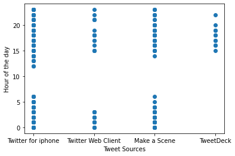

# Project: Data Wrangling and Analysis of Twitter-based content <br> (Udacity - case study: WeRateDogs archive)


## Table of Contents
<ul>
<li><a href="#intro">Introduction</a></li>
<li><a href="#collection">Data Gathering</a></li>
<li><a href="#assessment">Data Assessment</a></li>    
<li><a href="#wrangling">Data Cleaning</a></li>
<li><a href="#master">Creating tidy master Dataset and storing the data</a></li>
<li><a href="#analysis">Analysis and visualizations</a></li>  
<li><a href="#reference">References used</a></li>     
</ul>

<a id='intro'></a>

## Introduction 

This project's objective is to collect WeRateDogs Twitter data and use it to provide insightful and reliable analyses and visualizations. Although the Twitter archive is fantastic, it only includes the most fundamental tweet data. To create stunning and deserving analysis and visualizations, more data needs to be gathered, assessed, and cleaned. This project aims to manipulate WeRateDogs Twitter data to produce engaging and reliable analyses and infographics. Despite being fantastic, the Twitter archive only includes the most fundamental tweet data. For generating spectacular and deserving analysis and visualizations, more data needs to be collected, assessed, and cleaned.

### The necessary python libraries will be loaded to work with


```python
import pandas as pd 
import numpy as np
import matplotlib.pyplot as plt
import seaborn as sns
import requests
import os
import json
%matplotlib inline
```

<a id='collection'></a>
## Data Gathering

First loading the data from twitter archive


```python
df_twarchive = pd.read_csv('twitter-archive-enhanced.csv')
```


```python
df_twarchive.head(2)
```


<div>
<style scoped>
    .dataframe tbody tr th:only-of-type {
        vertical-align: middle;
    }

    .dataframe tbody tr th {
        vertical-align: top;
    }

    .dataframe thead th {
        text-align: right;
    }
</style>
<table border="1" class="dataframe">
  <thead>
    <tr style="text-align: right;">
      <th></th>
      <th>tweet_id</th>
      <th>in_reply_to_status_id</th>
      <th>in_reply_to_user_id</th>
      <th>timestamp</th>
      <th>source</th>
      <th>text</th>
      <th>retweeted_status_id</th>
      <th>retweeted_status_user_id</th>
      <th>retweeted_status_timestamp</th>
      <th>expanded_urls</th>
      <th>rating_numerator</th>
      <th>rating_denominator</th>
      <th>name</th>
      <th>doggo</th>
      <th>floofer</th>
      <th>pupper</th>
      <th>puppo</th>
    </tr>
  </thead>
  <tbody>
    <tr>
      <th>0</th>
      <td>892420643555336193</td>
      <td>NaN</td>
      <td>NaN</td>
      <td>2017-08-01 16:23:56 +0000</td>
      <td>&lt;a href="http://twitter.com/download/iphone" r...</td>
      <td>This is Phineas. He's a mystical boy. Only eve...</td>
      <td>NaN</td>
      <td>NaN</td>
      <td>NaN</td>
      <td>https://twitter.com/dog_rates/status/892420643...</td>
      <td>13</td>
      <td>10</td>
      <td>Phineas</td>
      <td>None</td>
      <td>None</td>
      <td>None</td>
      <td>None</td>
    </tr>
    <tr>
      <th>1</th>
      <td>892177421306343426</td>
      <td>NaN</td>
      <td>NaN</td>
      <td>2017-08-01 00:17:27 +0000</td>
      <td>&lt;a href="http://twitter.com/download/iphone" r...</td>
      <td>This is Tilly. She's just checking pup on you....</td>
      <td>NaN</td>
      <td>NaN</td>
      <td>NaN</td>
      <td>https://twitter.com/dog_rates/status/892177421...</td>
      <td>13</td>
      <td>10</td>
      <td>Tilly</td>
      <td>None</td>
      <td>None</td>
      <td>None</td>
      <td>None</td>
    </tr>
  </tbody>
</table>
</div>


```python
#This function will be used to download image-predictions.tsv file
import os
import requests

def download_file(url, filename):
    ''' Downloads file from the url and save it as filename '''
    # check if file already exists
    if not os.path.isfile(filename):
        print('Downloading File')
        response = requests.get(url)
        # Check if the response is ok (200)
        if response.status_code == 200:
            # Open file and write the content
            with open(filename, 'wb') as file:
                # A chunk of 128 bytes
                for chunk in response:
                    file.write(chunk)
    else:
        print('File exists')
```


```python
url = 'https://d17h27t6h515a5.cloudfront.net/topher/2017/August/599fd2ad_image-predictions/image-predictions.tsv'
filename = 'image-predictions.tsv'
download_file(url, filename)
```

    File exists
    


```python
df_image_predictions = pd.read_csv('image-predictions.tsv', sep = '\t')
```


```python
df_image_predictions
```


<div>
<style scoped>
    .dataframe tbody tr th:only-of-type {
        vertical-align: middle;
    }

    .dataframe tbody tr th {
        vertical-align: top;
    }

    .dataframe thead th {
        text-align: right;
    }
</style>
<table border="1" class="dataframe">
  <thead>
    <tr style="text-align: right;">
      <th></th>
      <th>tweet_id</th>
      <th>jpg_url</th>
      <th>img_num</th>
      <th>p1</th>
      <th>p1_conf</th>
      <th>p1_dog</th>
      <th>p2</th>
      <th>p2_conf</th>
      <th>p2_dog</th>
      <th>p3</th>
      <th>p3_conf</th>
      <th>p3_dog</th>
    </tr>
  </thead>
  <tbody>
    <tr>
      <th>0</th>
      <td>666020888022790149</td>
      <td>https://pbs.twimg.com/media/CT4udn0WwAA0aMy.jpg</td>
      <td>1</td>
      <td>Welsh_springer_spaniel</td>
      <td>0.465074</td>
      <td>True</td>
      <td>collie</td>
      <td>0.156665</td>
      <td>True</td>
      <td>Shetland_sheepdog</td>
      <td>0.061428</td>
      <td>True</td>
    </tr>
    <tr>
      <th>1</th>
      <td>666029285002620928</td>
      <td>https://pbs.twimg.com/media/CT42GRgUYAA5iDo.jpg</td>
      <td>1</td>
      <td>redbone</td>
      <td>0.506826</td>
      <td>True</td>
      <td>miniature_pinscher</td>
      <td>0.074192</td>
      <td>True</td>
      <td>Rhodesian_ridgeback</td>
      <td>0.072010</td>
      <td>True</td>
    </tr>
    <tr>
      <th>2</th>
      <td>666033412701032449</td>
      <td>https://pbs.twimg.com/media/CT4521TWwAEvMyu.jpg</td>
      <td>1</td>
      <td>German_shepherd</td>
      <td>0.596461</td>
      <td>True</td>
      <td>malinois</td>
      <td>0.138584</td>
      <td>True</td>
      <td>bloodhound</td>
      <td>0.116197</td>
      <td>True</td>
    </tr>
    <tr>
      <th>3</th>
      <td>666044226329800704</td>
      <td>https://pbs.twimg.com/media/CT5Dr8HUEAA-lEu.jpg</td>
      <td>1</td>
      <td>Rhodesian_ridgeback</td>
      <td>0.408143</td>
      <td>True</td>
      <td>redbone</td>
      <td>0.360687</td>
      <td>True</td>
      <td>miniature_pinscher</td>
      <td>0.222752</td>
      <td>True</td>
    </tr>
    <tr>
      <th>4</th>
      <td>666049248165822465</td>
      <td>https://pbs.twimg.com/media/CT5IQmsXIAAKY4A.jpg</td>
      <td>1</td>
      <td>miniature_pinscher</td>
      <td>0.560311</td>
      <td>True</td>
      <td>Rottweiler</td>
      <td>0.243682</td>
      <td>True</td>
      <td>Doberman</td>
      <td>0.154629</td>
      <td>True</td>
    </tr>
    <tr>
      <th>...</th>
      <td>...</td>
      <td>...</td>
      <td>...</td>
      <td>...</td>
      <td>...</td>
      <td>...</td>
      <td>...</td>
      <td>...</td>
      <td>...</td>
      <td>...</td>
      <td>...</td>
      <td>...</td>
    </tr>
    <tr>
      <th>2070</th>
      <td>891327558926688256</td>
      <td>https://pbs.twimg.com/media/DF6hr6BUMAAzZgT.jpg</td>
      <td>2</td>
      <td>basset</td>
      <td>0.555712</td>
      <td>True</td>
      <td>English_springer</td>
      <td>0.225770</td>
      <td>True</td>
      <td>German_short-haired_pointer</td>
      <td>0.175219</td>
      <td>True</td>
    </tr>
    <tr>
      <th>2071</th>
      <td>891689557279858688</td>
      <td>https://pbs.twimg.com/media/DF_q7IAWsAEuuN8.jpg</td>
      <td>1</td>
      <td>paper_towel</td>
      <td>0.170278</td>
      <td>False</td>
      <td>Labrador_retriever</td>
      <td>0.168086</td>
      <td>True</td>
      <td>spatula</td>
      <td>0.040836</td>
      <td>False</td>
    </tr>
    <tr>
      <th>2072</th>
      <td>891815181378084864</td>
      <td>https://pbs.twimg.com/media/DGBdLU1WsAANxJ9.jpg</td>
      <td>1</td>
      <td>Chihuahua</td>
      <td>0.716012</td>
      <td>True</td>
      <td>malamute</td>
      <td>0.078253</td>
      <td>True</td>
      <td>kelpie</td>
      <td>0.031379</td>
      <td>True</td>
    </tr>
    <tr>
      <th>2073</th>
      <td>892177421306343426</td>
      <td>https://pbs.twimg.com/media/DGGmoV4XsAAUL6n.jpg</td>
      <td>1</td>
      <td>Chihuahua</td>
      <td>0.323581</td>
      <td>True</td>
      <td>Pekinese</td>
      <td>0.090647</td>
      <td>True</td>
      <td>papillon</td>
      <td>0.068957</td>
      <td>True</td>
    </tr>
    <tr>
      <th>2074</th>
      <td>892420643555336193</td>
      <td>https://pbs.twimg.com/media/DGKD1-bXoAAIAUK.jpg</td>
      <td>1</td>
      <td>orange</td>
      <td>0.097049</td>
      <td>False</td>
      <td>bagel</td>
      <td>0.085851</td>
      <td>False</td>
      <td>banana</td>
      <td>0.076110</td>
      <td>False</td>
    </tr>
  </tbody>
</table>
<p>2075 rows × 12 columns</p>
</div>


```python
#Using tweet-json.txt provided for extra data while waiting for twitter for full access to the API
tweets_list = []
with open('tweet-json.txt', 'r') as file:
   for line in file:
     data = json.loads(line)
     tweets_list.append(data)
df_tweets = pd.DataFrame(tweets_list, columns=['id', 'retweet_count', 'favorite_count'])
```


```python
import tweepy
from tweepy import OAuthHandler
import json
from timeit import default_timer as timer

# Query Twitter API for each tweet in the Twitter archive and save JSON in a text file
# These are hidden to comply with Twitter's API terms and conditions
consumer_key = 'HIDDEN'
consumer_secret = 'HIDDEN'
access_token = 'HIDDEN'
access_secret = 'HIDDEN'

auth = OAuthHandler(consumer_key, consumer_secret)
auth.set_access_token(access_token, access_secret)

api = tweepy.API(auth, wait_on_rate_limit=True)
```

The remaining part of the algorithm


```python
# tweet_ids = df_twarchive.tweet_id.values
# len(tweet_ids)
# Query Twitter's API for JSON data for each tweet ID in the Twitter archive
# count = 0
# fails_dict = {}
# start = timer()
# Save each tweet's returned JSON as a new line in a .txt file
# with open('tweet_json.txt', 'w') as outfile:
#     # This loop will likely take 20-30 minutes to run because of Twitter's rate limit
#     for tweet_id in tweet_ids:
#         count += 1
#         print(str(count) + ": " + str(tweet_id))
#         try:
#             tweet = api.get_status(tweet_id, tweet_mode='extended')
#             print("Success")
#             json.dump(tweet._json, outfile)
#             outfile.write('\n')
#         except tweepy.TweepError as e:
#             print("Fail")
#             fails_dict[tweet_id] = e
#             pass
# end = timer()
# print(end - start)
# print(fails_dict)
```

Then the next step will be assessing this gathered data

<a id='assessment'></a>
## Data assessment

### Visual assessment


```python
df_twarchive.head(25)
```


<div>
<style scoped>
    .dataframe tbody tr th:only-of-type {
        vertical-align: middle;
    }

    .dataframe tbody tr th {
        vertical-align: top;
    }

    .dataframe thead th {
        text-align: right;
    }
</style>
<table border="1" class="dataframe">
  <thead>
    <tr style="text-align: right;">
      <th></th>
      <th>tweet_id</th>
      <th>in_reply_to_status_id</th>
      <th>in_reply_to_user_id</th>
      <th>timestamp</th>
      <th>source</th>
      <th>text</th>
      <th>retweeted_status_id</th>
      <th>retweeted_status_user_id</th>
      <th>retweeted_status_timestamp</th>
      <th>expanded_urls</th>
      <th>rating_numerator</th>
      <th>rating_denominator</th>
      <th>name</th>
      <th>doggo</th>
      <th>floofer</th>
      <th>pupper</th>
      <th>puppo</th>
    </tr>
  </thead>
  <tbody>
    <tr>
      <th>0</th>
      <td>892420643555336193</td>
      <td>NaN</td>
      <td>NaN</td>
      <td>2017-08-01 16:23:56 +0000</td>
      <td>&lt;a href="http://twitter.com/download/iphone" r...</td>
      <td>This is Phineas. He's a mystical boy. Only eve...</td>
      <td>NaN</td>
      <td>NaN</td>
      <td>NaN</td>
      <td>https://twitter.com/dog_rates/status/892420643...</td>
      <td>13</td>
      <td>10</td>
      <td>Phineas</td>
      <td>None</td>
      <td>None</td>
      <td>None</td>
      <td>None</td>
    </tr>
    <tr>
      <th>1</th>
      <td>892177421306343426</td>
      <td>NaN</td>
      <td>NaN</td>
      <td>2017-08-01 00:17:27 +0000</td>
      <td>&lt;a href="http://twitter.com/download/iphone" r...</td>
      <td>This is Tilly. She's just checking pup on you....</td>
      <td>NaN</td>
      <td>NaN</td>
      <td>NaN</td>
      <td>https://twitter.com/dog_rates/status/892177421...</td>
      <td>13</td>
      <td>10</td>
      <td>Tilly</td>
      <td>None</td>
      <td>None</td>
      <td>None</td>
      <td>None</td>
    </tr>
    <tr>
      <th>2</th>
      <td>891815181378084864</td>
      <td>NaN</td>
      <td>NaN</td>
      <td>2017-07-31 00:18:03 +0000</td>
      <td>&lt;a href="http://twitter.com/download/iphone" r...</td>
      <td>This is Archie. He is a rare Norwegian Pouncin...</td>
      <td>NaN</td>
      <td>NaN</td>
      <td>NaN</td>
      <td>https://twitter.com/dog_rates/status/891815181...</td>
      <td>12</td>
      <td>10</td>
      <td>Archie</td>
      <td>None</td>
      <td>None</td>
      <td>None</td>
      <td>None</td>
    </tr>
    <tr>
      <th>3</th>
      <td>891689557279858688</td>
      <td>NaN</td>
      <td>NaN</td>
      <td>2017-07-30 15:58:51 +0000</td>
      <td>&lt;a href="http://twitter.com/download/iphone" r...</td>
      <td>This is Darla. She commenced a snooze mid meal...</td>
      <td>NaN</td>
      <td>NaN</td>
      <td>NaN</td>
      <td>https://twitter.com/dog_rates/status/891689557...</td>
      <td>13</td>
      <td>10</td>
      <td>Darla</td>
      <td>None</td>
      <td>None</td>
      <td>None</td>
      <td>None</td>
    </tr>
    <tr>
      <th>4</th>
      <td>891327558926688256</td>
      <td>NaN</td>
      <td>NaN</td>
      <td>2017-07-29 16:00:24 +0000</td>
      <td>&lt;a href="http://twitter.com/download/iphone" r...</td>
      <td>This is Franklin. He would like you to stop ca...</td>
      <td>NaN</td>
      <td>NaN</td>
      <td>NaN</td>
      <td>https://twitter.com/dog_rates/status/891327558...</td>
      <td>12</td>
      <td>10</td>
      <td>Franklin</td>
      <td>None</td>
      <td>None</td>
      <td>None</td>
      <td>None</td>
    </tr>
    <tr>
      <th>5</th>
      <td>891087950875897856</td>
      <td>NaN</td>
      <td>NaN</td>
      <td>2017-07-29 00:08:17 +0000</td>
      <td>&lt;a href="http://twitter.com/download/iphone" r...</td>
      <td>Here we have a majestic great white breaching ...</td>
      <td>NaN</td>
      <td>NaN</td>
      <td>NaN</td>
      <td>https://twitter.com/dog_rates/status/891087950...</td>
      <td>13</td>
      <td>10</td>
      <td>None</td>
      <td>None</td>
      <td>None</td>
      <td>None</td>
      <td>None</td>
    </tr>
    <tr>
      <th>6</th>
      <td>890971913173991426</td>
      <td>NaN</td>
      <td>NaN</td>
      <td>2017-07-28 16:27:12 +0000</td>
      <td>&lt;a href="http://twitter.com/download/iphone" r...</td>
      <td>Meet Jax. He enjoys ice cream so much he gets ...</td>
      <td>NaN</td>
      <td>NaN</td>
      <td>NaN</td>
      <td>https://gofundme.com/ydvmve-surgery-for-jax,ht...</td>
      <td>13</td>
      <td>10</td>
      <td>Jax</td>
      <td>None</td>
      <td>None</td>
      <td>None</td>
      <td>None</td>
    </tr>
    <tr>
      <th>7</th>
      <td>890729181411237888</td>
      <td>NaN</td>
      <td>NaN</td>
      <td>2017-07-28 00:22:40 +0000</td>
      <td>&lt;a href="http://twitter.com/download/iphone" r...</td>
      <td>When you watch your owner call another dog a g...</td>
      <td>NaN</td>
      <td>NaN</td>
      <td>NaN</td>
      <td>https://twitter.com/dog_rates/status/890729181...</td>
      <td>13</td>
      <td>10</td>
      <td>None</td>
      <td>None</td>
      <td>None</td>
      <td>None</td>
      <td>None</td>
    </tr>
    <tr>
      <th>8</th>
      <td>890609185150312448</td>
      <td>NaN</td>
      <td>NaN</td>
      <td>2017-07-27 16:25:51 +0000</td>
      <td>&lt;a href="http://twitter.com/download/iphone" r...</td>
      <td>This is Zoey. She doesn't want to be one of th...</td>
      <td>NaN</td>
      <td>NaN</td>
      <td>NaN</td>
      <td>https://twitter.com/dog_rates/status/890609185...</td>
      <td>13</td>
      <td>10</td>
      <td>Zoey</td>
      <td>None</td>
      <td>None</td>
      <td>None</td>
      <td>None</td>
    </tr>
    <tr>
      <th>9</th>
      <td>890240255349198849</td>
      <td>NaN</td>
      <td>NaN</td>
      <td>2017-07-26 15:59:51 +0000</td>
      <td>&lt;a href="http://twitter.com/download/iphone" r...</td>
      <td>This is Cassie. She is a college pup. Studying...</td>
      <td>NaN</td>
      <td>NaN</td>
      <td>NaN</td>
      <td>https://twitter.com/dog_rates/status/890240255...</td>
      <td>14</td>
      <td>10</td>
      <td>Cassie</td>
      <td>doggo</td>
      <td>None</td>
      <td>None</td>
      <td>None</td>
    </tr>
    <tr>
      <th>10</th>
      <td>890006608113172480</td>
      <td>NaN</td>
      <td>NaN</td>
      <td>2017-07-26 00:31:25 +0000</td>
      <td>&lt;a href="http://twitter.com/download/iphone" r...</td>
      <td>This is Koda. He is a South Australian decksha...</td>
      <td>NaN</td>
      <td>NaN</td>
      <td>NaN</td>
      <td>https://twitter.com/dog_rates/status/890006608...</td>
      <td>13</td>
      <td>10</td>
      <td>Koda</td>
      <td>None</td>
      <td>None</td>
      <td>None</td>
      <td>None</td>
    </tr>
    <tr>
      <th>11</th>
      <td>889880896479866881</td>
      <td>NaN</td>
      <td>NaN</td>
      <td>2017-07-25 16:11:53 +0000</td>
      <td>&lt;a href="http://twitter.com/download/iphone" r...</td>
      <td>This is Bruno. He is a service shark. Only get...</td>
      <td>NaN</td>
      <td>NaN</td>
      <td>NaN</td>
      <td>https://twitter.com/dog_rates/status/889880896...</td>
      <td>13</td>
      <td>10</td>
      <td>Bruno</td>
      <td>None</td>
      <td>None</td>
      <td>None</td>
      <td>None</td>
    </tr>
    <tr>
      <th>12</th>
      <td>889665388333682689</td>
      <td>NaN</td>
      <td>NaN</td>
      <td>2017-07-25 01:55:32 +0000</td>
      <td>&lt;a href="http://twitter.com/download/iphone" r...</td>
      <td>Here's a puppo that seems to be on the fence a...</td>
      <td>NaN</td>
      <td>NaN</td>
      <td>NaN</td>
      <td>https://twitter.com/dog_rates/status/889665388...</td>
      <td>13</td>
      <td>10</td>
      <td>None</td>
      <td>None</td>
      <td>None</td>
      <td>None</td>
      <td>puppo</td>
    </tr>
    <tr>
      <th>13</th>
      <td>889638837579907072</td>
      <td>NaN</td>
      <td>NaN</td>
      <td>2017-07-25 00:10:02 +0000</td>
      <td>&lt;a href="http://twitter.com/download/iphone" r...</td>
      <td>This is Ted. He does his best. Sometimes that'...</td>
      <td>NaN</td>
      <td>NaN</td>
      <td>NaN</td>
      <td>https://twitter.com/dog_rates/status/889638837...</td>
      <td>12</td>
      <td>10</td>
      <td>Ted</td>
      <td>None</td>
      <td>None</td>
      <td>None</td>
      <td>None</td>
    </tr>
    <tr>
      <th>14</th>
      <td>889531135344209921</td>
      <td>NaN</td>
      <td>NaN</td>
      <td>2017-07-24 17:02:04 +0000</td>
      <td>&lt;a href="http://twitter.com/download/iphone" r...</td>
      <td>This is Stuart. He's sporting his favorite fan...</td>
      <td>NaN</td>
      <td>NaN</td>
      <td>NaN</td>
      <td>https://twitter.com/dog_rates/status/889531135...</td>
      <td>13</td>
      <td>10</td>
      <td>Stuart</td>
      <td>None</td>
      <td>None</td>
      <td>None</td>
      <td>puppo</td>
    </tr>
    <tr>
      <th>15</th>
      <td>889278841981685760</td>
      <td>NaN</td>
      <td>NaN</td>
      <td>2017-07-24 00:19:32 +0000</td>
      <td>&lt;a href="http://twitter.com/download/iphone" r...</td>
      <td>This is Oliver. You're witnessing one of his m...</td>
      <td>NaN</td>
      <td>NaN</td>
      <td>NaN</td>
      <td>https://twitter.com/dog_rates/status/889278841...</td>
      <td>13</td>
      <td>10</td>
      <td>Oliver</td>
      <td>None</td>
      <td>None</td>
      <td>None</td>
      <td>None</td>
    </tr>
    <tr>
      <th>16</th>
      <td>888917238123831296</td>
      <td>NaN</td>
      <td>NaN</td>
      <td>2017-07-23 00:22:39 +0000</td>
      <td>&lt;a href="http://twitter.com/download/iphone" r...</td>
      <td>This is Jim. He found a fren. Taught him how t...</td>
      <td>NaN</td>
      <td>NaN</td>
      <td>NaN</td>
      <td>https://twitter.com/dog_rates/status/888917238...</td>
      <td>12</td>
      <td>10</td>
      <td>Jim</td>
      <td>None</td>
      <td>None</td>
      <td>None</td>
      <td>None</td>
    </tr>
    <tr>
      <th>17</th>
      <td>888804989199671297</td>
      <td>NaN</td>
      <td>NaN</td>
      <td>2017-07-22 16:56:37 +0000</td>
      <td>&lt;a href="http://twitter.com/download/iphone" r...</td>
      <td>This is Zeke. He has a new stick. Very proud o...</td>
      <td>NaN</td>
      <td>NaN</td>
      <td>NaN</td>
      <td>https://twitter.com/dog_rates/status/888804989...</td>
      <td>13</td>
      <td>10</td>
      <td>Zeke</td>
      <td>None</td>
      <td>None</td>
      <td>None</td>
      <td>None</td>
    </tr>
    <tr>
      <th>18</th>
      <td>888554962724278272</td>
      <td>NaN</td>
      <td>NaN</td>
      <td>2017-07-22 00:23:06 +0000</td>
      <td>&lt;a href="http://twitter.com/download/iphone" r...</td>
      <td>This is Ralphus. He's powering up. Attempting ...</td>
      <td>NaN</td>
      <td>NaN</td>
      <td>NaN</td>
      <td>https://twitter.com/dog_rates/status/888554962...</td>
      <td>13</td>
      <td>10</td>
      <td>Ralphus</td>
      <td>None</td>
      <td>None</td>
      <td>None</td>
      <td>None</td>
    </tr>
    <tr>
      <th>19</th>
      <td>888202515573088257</td>
      <td>NaN</td>
      <td>NaN</td>
      <td>2017-07-21 01:02:36 +0000</td>
      <td>&lt;a href="http://twitter.com/download/iphone" r...</td>
      <td>RT @dog_rates: This is Canela. She attempted s...</td>
      <td>8.874740e+17</td>
      <td>4.196984e+09</td>
      <td>2017-07-19 00:47:34 +0000</td>
      <td>https://twitter.com/dog_rates/status/887473957...</td>
      <td>13</td>
      <td>10</td>
      <td>Canela</td>
      <td>None</td>
      <td>None</td>
      <td>None</td>
      <td>None</td>
    </tr>
    <tr>
      <th>20</th>
      <td>888078434458587136</td>
      <td>NaN</td>
      <td>NaN</td>
      <td>2017-07-20 16:49:33 +0000</td>
      <td>&lt;a href="http://twitter.com/download/iphone" r...</td>
      <td>This is Gerald. He was just told he didn't get...</td>
      <td>NaN</td>
      <td>NaN</td>
      <td>NaN</td>
      <td>https://twitter.com/dog_rates/status/888078434...</td>
      <td>12</td>
      <td>10</td>
      <td>Gerald</td>
      <td>None</td>
      <td>None</td>
      <td>None</td>
      <td>None</td>
    </tr>
    <tr>
      <th>21</th>
      <td>887705289381826560</td>
      <td>NaN</td>
      <td>NaN</td>
      <td>2017-07-19 16:06:48 +0000</td>
      <td>&lt;a href="http://twitter.com/download/iphone" r...</td>
      <td>This is Jeffrey. He has a monopoly on the pool...</td>
      <td>NaN</td>
      <td>NaN</td>
      <td>NaN</td>
      <td>https://twitter.com/dog_rates/status/887705289...</td>
      <td>13</td>
      <td>10</td>
      <td>Jeffrey</td>
      <td>None</td>
      <td>None</td>
      <td>None</td>
      <td>None</td>
    </tr>
    <tr>
      <th>22</th>
      <td>887517139158093824</td>
      <td>NaN</td>
      <td>NaN</td>
      <td>2017-07-19 03:39:09 +0000</td>
      <td>&lt;a href="http://twitter.com/download/iphone" r...</td>
      <td>I've yet to rate a Venezuelan Hover Wiener. Th...</td>
      <td>NaN</td>
      <td>NaN</td>
      <td>NaN</td>
      <td>https://twitter.com/dog_rates/status/887517139...</td>
      <td>14</td>
      <td>10</td>
      <td>such</td>
      <td>None</td>
      <td>None</td>
      <td>None</td>
      <td>None</td>
    </tr>
    <tr>
      <th>23</th>
      <td>887473957103951883</td>
      <td>NaN</td>
      <td>NaN</td>
      <td>2017-07-19 00:47:34 +0000</td>
      <td>&lt;a href="http://twitter.com/download/iphone" r...</td>
      <td>This is Canela. She attempted some fancy porch...</td>
      <td>NaN</td>
      <td>NaN</td>
      <td>NaN</td>
      <td>https://twitter.com/dog_rates/status/887473957...</td>
      <td>13</td>
      <td>10</td>
      <td>Canela</td>
      <td>None</td>
      <td>None</td>
      <td>None</td>
      <td>None</td>
    </tr>
    <tr>
      <th>24</th>
      <td>887343217045368832</td>
      <td>NaN</td>
      <td>NaN</td>
      <td>2017-07-18 16:08:03 +0000</td>
      <td>&lt;a href="http://twitter.com/download/iphone" r...</td>
      <td>You may not have known you needed to see this ...</td>
      <td>NaN</td>
      <td>NaN</td>
      <td>NaN</td>
      <td>https://twitter.com/dog_rates/status/887343217...</td>
      <td>13</td>
      <td>10</td>
      <td>None</td>
      <td>None</td>
      <td>None</td>
      <td>None</td>
      <td>None</td>
    </tr>
  </tbody>
</table>
</div>


```python
df_image_predictions.head(15)
```


<div>
<style scoped>
    .dataframe tbody tr th:only-of-type {
        vertical-align: middle;
    }

    .dataframe tbody tr th {
        vertical-align: top;
    }

    .dataframe thead th {
        text-align: right;
    }
</style>
<table border="1" class="dataframe">
  <thead>
    <tr style="text-align: right;">
      <th></th>
      <th>tweet_id</th>
      <th>jpg_url</th>
      <th>img_num</th>
      <th>p1</th>
      <th>p1_conf</th>
      <th>p1_dog</th>
      <th>p2</th>
      <th>p2_conf</th>
      <th>p2_dog</th>
      <th>p3</th>
      <th>p3_conf</th>
      <th>p3_dog</th>
    </tr>
  </thead>
  <tbody>
    <tr>
      <th>0</th>
      <td>666020888022790149</td>
      <td>https://pbs.twimg.com/media/CT4udn0WwAA0aMy.jpg</td>
      <td>1</td>
      <td>Welsh_springer_spaniel</td>
      <td>0.465074</td>
      <td>True</td>
      <td>collie</td>
      <td>0.156665</td>
      <td>True</td>
      <td>Shetland_sheepdog</td>
      <td>0.061428</td>
      <td>True</td>
    </tr>
    <tr>
      <th>1</th>
      <td>666029285002620928</td>
      <td>https://pbs.twimg.com/media/CT42GRgUYAA5iDo.jpg</td>
      <td>1</td>
      <td>redbone</td>
      <td>0.506826</td>
      <td>True</td>
      <td>miniature_pinscher</td>
      <td>0.074192</td>
      <td>True</td>
      <td>Rhodesian_ridgeback</td>
      <td>0.072010</td>
      <td>True</td>
    </tr>
    <tr>
      <th>2</th>
      <td>666033412701032449</td>
      <td>https://pbs.twimg.com/media/CT4521TWwAEvMyu.jpg</td>
      <td>1</td>
      <td>German_shepherd</td>
      <td>0.596461</td>
      <td>True</td>
      <td>malinois</td>
      <td>0.138584</td>
      <td>True</td>
      <td>bloodhound</td>
      <td>0.116197</td>
      <td>True</td>
    </tr>
    <tr>
      <th>3</th>
      <td>666044226329800704</td>
      <td>https://pbs.twimg.com/media/CT5Dr8HUEAA-lEu.jpg</td>
      <td>1</td>
      <td>Rhodesian_ridgeback</td>
      <td>0.408143</td>
      <td>True</td>
      <td>redbone</td>
      <td>0.360687</td>
      <td>True</td>
      <td>miniature_pinscher</td>
      <td>0.222752</td>
      <td>True</td>
    </tr>
    <tr>
      <th>4</th>
      <td>666049248165822465</td>
      <td>https://pbs.twimg.com/media/CT5IQmsXIAAKY4A.jpg</td>
      <td>1</td>
      <td>miniature_pinscher</td>
      <td>0.560311</td>
      <td>True</td>
      <td>Rottweiler</td>
      <td>0.243682</td>
      <td>True</td>
      <td>Doberman</td>
      <td>0.154629</td>
      <td>True</td>
    </tr>
    <tr>
      <th>5</th>
      <td>666050758794694657</td>
      <td>https://pbs.twimg.com/media/CT5Jof1WUAEuVxN.jpg</td>
      <td>1</td>
      <td>Bernese_mountain_dog</td>
      <td>0.651137</td>
      <td>True</td>
      <td>English_springer</td>
      <td>0.263788</td>
      <td>True</td>
      <td>Greater_Swiss_Mountain_dog</td>
      <td>0.016199</td>
      <td>True</td>
    </tr>
    <tr>
      <th>6</th>
      <td>666051853826850816</td>
      <td>https://pbs.twimg.com/media/CT5KoJ1WoAAJash.jpg</td>
      <td>1</td>
      <td>box_turtle</td>
      <td>0.933012</td>
      <td>False</td>
      <td>mud_turtle</td>
      <td>0.045885</td>
      <td>False</td>
      <td>terrapin</td>
      <td>0.017885</td>
      <td>False</td>
    </tr>
    <tr>
      <th>7</th>
      <td>666055525042405380</td>
      <td>https://pbs.twimg.com/media/CT5N9tpXIAAifs1.jpg</td>
      <td>1</td>
      <td>chow</td>
      <td>0.692517</td>
      <td>True</td>
      <td>Tibetan_mastiff</td>
      <td>0.058279</td>
      <td>True</td>
      <td>fur_coat</td>
      <td>0.054449</td>
      <td>False</td>
    </tr>
    <tr>
      <th>8</th>
      <td>666057090499244032</td>
      <td>https://pbs.twimg.com/media/CT5PY90WoAAQGLo.jpg</td>
      <td>1</td>
      <td>shopping_cart</td>
      <td>0.962465</td>
      <td>False</td>
      <td>shopping_basket</td>
      <td>0.014594</td>
      <td>False</td>
      <td>golden_retriever</td>
      <td>0.007959</td>
      <td>True</td>
    </tr>
    <tr>
      <th>9</th>
      <td>666058600524156928</td>
      <td>https://pbs.twimg.com/media/CT5Qw94XAAA_2dP.jpg</td>
      <td>1</td>
      <td>miniature_poodle</td>
      <td>0.201493</td>
      <td>True</td>
      <td>komondor</td>
      <td>0.192305</td>
      <td>True</td>
      <td>soft-coated_wheaten_terrier</td>
      <td>0.082086</td>
      <td>True</td>
    </tr>
    <tr>
      <th>10</th>
      <td>666063827256086533</td>
      <td>https://pbs.twimg.com/media/CT5Vg_wXIAAXfnj.jpg</td>
      <td>1</td>
      <td>golden_retriever</td>
      <td>0.775930</td>
      <td>True</td>
      <td>Tibetan_mastiff</td>
      <td>0.093718</td>
      <td>True</td>
      <td>Labrador_retriever</td>
      <td>0.072427</td>
      <td>True</td>
    </tr>
    <tr>
      <th>11</th>
      <td>666071193221509120</td>
      <td>https://pbs.twimg.com/media/CT5cN_3WEAAlOoZ.jpg</td>
      <td>1</td>
      <td>Gordon_setter</td>
      <td>0.503672</td>
      <td>True</td>
      <td>Yorkshire_terrier</td>
      <td>0.174201</td>
      <td>True</td>
      <td>Pekinese</td>
      <td>0.109454</td>
      <td>True</td>
    </tr>
    <tr>
      <th>12</th>
      <td>666073100786774016</td>
      <td>https://pbs.twimg.com/media/CT5d9DZXAAALcwe.jpg</td>
      <td>1</td>
      <td>Walker_hound</td>
      <td>0.260857</td>
      <td>True</td>
      <td>English_foxhound</td>
      <td>0.175382</td>
      <td>True</td>
      <td>Ibizan_hound</td>
      <td>0.097471</td>
      <td>True</td>
    </tr>
    <tr>
      <th>13</th>
      <td>666082916733198337</td>
      <td>https://pbs.twimg.com/media/CT5m4VGWEAAtKc8.jpg</td>
      <td>1</td>
      <td>pug</td>
      <td>0.489814</td>
      <td>True</td>
      <td>bull_mastiff</td>
      <td>0.404722</td>
      <td>True</td>
      <td>French_bulldog</td>
      <td>0.048960</td>
      <td>True</td>
    </tr>
    <tr>
      <th>14</th>
      <td>666094000022159362</td>
      <td>https://pbs.twimg.com/media/CT5w9gUW4AAsBNN.jpg</td>
      <td>1</td>
      <td>bloodhound</td>
      <td>0.195217</td>
      <td>True</td>
      <td>German_shepherd</td>
      <td>0.078260</td>
      <td>True</td>
      <td>malinois</td>
      <td>0.075628</td>
      <td>True</td>
    </tr>
  </tbody>
</table>
</div>


```python
df_tweets.head(5)
```


<div>
<style scoped>
    .dataframe tbody tr th:only-of-type {
        vertical-align: middle;
    }

    .dataframe tbody tr th {
        vertical-align: top;
    }

    .dataframe thead th {
        text-align: right;
    }
</style>
<table border="1" class="dataframe">
  <thead>
    <tr style="text-align: right;">
      <th></th>
      <th>id</th>
      <th>retweet_count</th>
      <th>favorite_count</th>
    </tr>
  </thead>
  <tbody>
    <tr>
      <th>0</th>
      <td>892420643555336193</td>
      <td>8853</td>
      <td>39467</td>
    </tr>
    <tr>
      <th>1</th>
      <td>892177421306343426</td>
      <td>6514</td>
      <td>33819</td>
    </tr>
    <tr>
      <th>2</th>
      <td>891815181378084864</td>
      <td>4328</td>
      <td>25461</td>
    </tr>
    <tr>
      <th>3</th>
      <td>891689557279858688</td>
      <td>8964</td>
      <td>42908</td>
    </tr>
    <tr>
      <th>4</th>
      <td>891327558926688256</td>
      <td>9774</td>
      <td>41048</td>
    </tr>
  </tbody>
</table>
</div>


### Programmatic assessment


```python
df_twarchive.shape
```


    (2356, 17)


```python
df_twarchive.info()
```

    <class 'pandas.core.frame.DataFrame'>
    RangeIndex: 2356 entries, 0 to 2355
    Data columns (total 17 columns):
     #   Column                      Non-Null Count  Dtype  
    ---  ------                      --------------  -----  
     0   tweet_id                    2356 non-null   int64  
     1   in_reply_to_status_id       78 non-null     float64
     2   in_reply_to_user_id         78 non-null     float64
     3   timestamp                   2356 non-null   object 
     4   source                      2356 non-null   object 
     5   text                        2356 non-null   object 
     6   retweeted_status_id         181 non-null    float64
     7   retweeted_status_user_id    181 non-null    float64
     8   retweeted_status_timestamp  181 non-null    object 
     9   expanded_urls               2297 non-null   object 
     10  rating_numerator            2356 non-null   int64  
     11  rating_denominator          2356 non-null   int64  
     12  name                        2356 non-null   object 
     13  doggo                       2356 non-null   object 
     14  floofer                     2356 non-null   object 
     15  pupper                      2356 non-null   object 
     16  puppo                       2356 non-null   object 
    dtypes: float64(4), int64(3), object(10)
    memory usage: 313.0+ KB
    


```python
df_twarchive['timestamp']
```


    0       2017-08-01 16:23:56 +0000
    1       2017-08-01 00:17:27 +0000
    2       2017-07-31 00:18:03 +0000
    3       2017-07-30 15:58:51 +0000
    4       2017-07-29 16:00:24 +0000
                      ...            
    2351    2015-11-16 00:24:50 +0000
    2352    2015-11-16 00:04:52 +0000
    2353    2015-11-15 23:21:54 +0000
    2354    2015-11-15 23:05:30 +0000
    2355    2015-11-15 22:32:08 +0000
    Name: timestamp, Length: 2356, dtype: object


The columns **in_reply_to_status_id,in_reply_to_user_id,retweeted_status_id,retweeted_status_user_id,retweeted_status_timestamp,expanded_urls** have missing values


```python
df_twarchive['tweet_id'].value_counts()
```


    892420643555336193    1
    687102708889812993    1
    687826841265172480    1
    687818504314159109    1
    687807801670897665    1
                         ..
    775085132600442880    1
    774757898236878852    1
    774639387460112384    1
    774314403806253056    1
    666020888022790149    1
    Name: tweet_id, Length: 2356, dtype: int64


```python
df_twarchive['in_reply_to_status_id'].value_counts()
```


    6.671522e+17    2
    8.862664e+17    1
    6.920419e+17    1
    6.827884e+17    1
    6.842229e+17    1
                   ..
    8.116272e+17    1
    8.131273e+17    1
    8.211526e+17    1
    8.233264e+17    1
    6.670655e+17    1
    Name: in_reply_to_status_id, Length: 77, dtype: int64


```python
df_twarchive['source'].unique()
```


    array(['<a href="http://twitter.com/download/iphone" rel="nofollow">Twitter for iPhone</a>',
           '<a href="http://twitter.com" rel="nofollow">Twitter Web Client</a>',
           '<a href="http://vine.co" rel="nofollow">Vine - Make a Scene</a>',
           '<a href="https://about.twitter.com/products/tweetdeck" rel="nofollow">TweetDeck</a>'],
          dtype=object)


Source column contains duplicates


```python
df_twarchive['source'].value_counts()
```


    <a href="http://twitter.com/download/iphone" rel="nofollow">Twitter for iPhone</a>     2221
    <a href="http://vine.co" rel="nofollow">Vine - Make a Scene</a>                          91
    <a href="http://twitter.com" rel="nofollow">Twitter Web Client</a>                       33
    <a href="https://about.twitter.com/products/tweetdeck" rel="nofollow">TweetDeck</a>      11
    Name: source, dtype: int64


```python
df_tweets.shape
```


    (2354, 3)


```python
df_tweets.info()
```

    <class 'pandas.core.frame.DataFrame'>
    RangeIndex: 2354 entries, 0 to 2353
    Data columns (total 3 columns):
     #   Column          Non-Null Count  Dtype
    ---  ------          --------------  -----
     0   id              2354 non-null   int64
     1   retweet_count   2354 non-null   int64
     2   favorite_count  2354 non-null   int64
    dtypes: int64(3)
    memory usage: 55.3 KB
    


```python
df_tweets['favorite_count'].value_counts()
```


    0       179
    2706      3
    2918      3
    610       3
    2768      3
           ... 
    7493      1
    6671      1
    4484      1
    2872      1
    2535      1
    Name: favorite_count, Length: 2007, dtype: int64


```python
df_image_predictions.shape
```


    (2075, 12)


```python
df_image_predictions.info()
```

    <class 'pandas.core.frame.DataFrame'>
    RangeIndex: 2075 entries, 0 to 2074
    Data columns (total 12 columns):
     #   Column    Non-Null Count  Dtype  
    ---  ------    --------------  -----  
     0   tweet_id  2075 non-null   int64  
     1   jpg_url   2075 non-null   object 
     2   img_num   2075 non-null   int64  
     3   p1        2075 non-null   object 
     4   p1_conf   2075 non-null   float64
     5   p1_dog    2075 non-null   bool   
     6   p2        2075 non-null   object 
     7   p2_conf   2075 non-null   float64
     8   p2_dog    2075 non-null   bool   
     9   p3        2075 non-null   object 
     10  p3_conf   2075 non-null   float64
     11  p3_dog    2075 non-null   bool   
    dtypes: bool(3), float64(3), int64(2), object(4)
    memory usage: 152.1+ KB
    

## Data quality issues found in this dataset were:

1. All retweets should be removed from the dataset
2. Missing values in columns doggo	floofer	pupper	puppo are represented as None and should be converted to NaN
3. In the image predictions dataset some p1 values start with small letters while others start with a capital letter, so for convenience all will start with capital letters.
4. In the image predictions dataset some p2 values start with small letters while others start with a capital letter, so for convenience all will start with capital letters.
5. Some dog names start with small letters thus will be converted to capital.
6. Some dog names such as **this** and **unacceptable** do not make any sense thus will be replaced with **No_Name**from the twitter archive dataset
7. Predictions P1, P2 and P3 will be formatted such that spacing will be whitespace rather than '_'
8. Timestamp for the tweetarchive will be converted to datetime format for better manipulation.


## Data tidiness issues found in this dataset were:
1. The columns  'doggo', 'floofer', 'pupper' and 'puppo', are to be merged to dog stages.
2. The columns rating_numerator and rating_denominator can be merged to a single column for better manipulation.

<a id='wrangling'></a>

## Data Cleaning 

**Now that the issues to clean have been assessed, I will enter to the next part which is cleaning these issues**


```python
#First copying the original dataset before entering into the cleaning part
clean_df_image_predictions = df_image_predictions.copy()
clean_df_tw_archive = df_twarchive.copy()
clean_df_tweets = df_tweets.copy()
```

## Fixing data quality errors 

### Define

1. All retweets should be removed from the dataset. Only original tweets are needed, thus here we can drop all columns related to the retweets

### Code


```python
#This code will help me remain with rows that have NaN retweet id's
clean_df_tw_archive = clean_df_tw_archive[clean_df_tw_archive['retweeted_status_id'].isna()]
clean_df_tw_archive = clean_df_tw_archive[clean_df_tw_archive['retweeted_status_user_id'].isna()]
```


```python
clean_df_tw_archive
```


<div>
<style scoped>
    .dataframe tbody tr th:only-of-type {
        vertical-align: middle;
    }

    .dataframe tbody tr th {
        vertical-align: top;
    }

    .dataframe thead th {
        text-align: right;
    }
</style>
<table border="1" class="dataframe">
  <thead>
    <tr style="text-align: right;">
      <th></th>
      <th>tweet_id</th>
      <th>in_reply_to_status_id</th>
      <th>in_reply_to_user_id</th>
      <th>timestamp</th>
      <th>source</th>
      <th>text</th>
      <th>retweeted_status_id</th>
      <th>retweeted_status_user_id</th>
      <th>retweeted_status_timestamp</th>
      <th>expanded_urls</th>
      <th>rating_numerator</th>
      <th>rating_denominator</th>
      <th>name</th>
      <th>doggo</th>
      <th>floofer</th>
      <th>pupper</th>
      <th>puppo</th>
    </tr>
  </thead>
  <tbody>
    <tr>
      <th>0</th>
      <td>892420643555336193</td>
      <td>NaN</td>
      <td>NaN</td>
      <td>2017-08-01 16:23:56 +0000</td>
      <td>&lt;a href="http://twitter.com/download/iphone" r...</td>
      <td>This is Phineas. He's a mystical boy. Only eve...</td>
      <td>NaN</td>
      <td>NaN</td>
      <td>NaN</td>
      <td>https://twitter.com/dog_rates/status/892420643...</td>
      <td>13</td>
      <td>10</td>
      <td>Phineas</td>
      <td>None</td>
      <td>None</td>
      <td>None</td>
      <td>None</td>
    </tr>
    <tr>
      <th>1</th>
      <td>892177421306343426</td>
      <td>NaN</td>
      <td>NaN</td>
      <td>2017-08-01 00:17:27 +0000</td>
      <td>&lt;a href="http://twitter.com/download/iphone" r...</td>
      <td>This is Tilly. She's just checking pup on you....</td>
      <td>NaN</td>
      <td>NaN</td>
      <td>NaN</td>
      <td>https://twitter.com/dog_rates/status/892177421...</td>
      <td>13</td>
      <td>10</td>
      <td>Tilly</td>
      <td>None</td>
      <td>None</td>
      <td>None</td>
      <td>None</td>
    </tr>
    <tr>
      <th>2</th>
      <td>891815181378084864</td>
      <td>NaN</td>
      <td>NaN</td>
      <td>2017-07-31 00:18:03 +0000</td>
      <td>&lt;a href="http://twitter.com/download/iphone" r...</td>
      <td>This is Archie. He is a rare Norwegian Pouncin...</td>
      <td>NaN</td>
      <td>NaN</td>
      <td>NaN</td>
      <td>https://twitter.com/dog_rates/status/891815181...</td>
      <td>12</td>
      <td>10</td>
      <td>Archie</td>
      <td>None</td>
      <td>None</td>
      <td>None</td>
      <td>None</td>
    </tr>
    <tr>
      <th>3</th>
      <td>891689557279858688</td>
      <td>NaN</td>
      <td>NaN</td>
      <td>2017-07-30 15:58:51 +0000</td>
      <td>&lt;a href="http://twitter.com/download/iphone" r...</td>
      <td>This is Darla. She commenced a snooze mid meal...</td>
      <td>NaN</td>
      <td>NaN</td>
      <td>NaN</td>
      <td>https://twitter.com/dog_rates/status/891689557...</td>
      <td>13</td>
      <td>10</td>
      <td>Darla</td>
      <td>None</td>
      <td>None</td>
      <td>None</td>
      <td>None</td>
    </tr>
    <tr>
      <th>4</th>
      <td>891327558926688256</td>
      <td>NaN</td>
      <td>NaN</td>
      <td>2017-07-29 16:00:24 +0000</td>
      <td>&lt;a href="http://twitter.com/download/iphone" r...</td>
      <td>This is Franklin. He would like you to stop ca...</td>
      <td>NaN</td>
      <td>NaN</td>
      <td>NaN</td>
      <td>https://twitter.com/dog_rates/status/891327558...</td>
      <td>12</td>
      <td>10</td>
      <td>Franklin</td>
      <td>None</td>
      <td>None</td>
      <td>None</td>
      <td>None</td>
    </tr>
    <tr>
      <th>...</th>
      <td>...</td>
      <td>...</td>
      <td>...</td>
      <td>...</td>
      <td>...</td>
      <td>...</td>
      <td>...</td>
      <td>...</td>
      <td>...</td>
      <td>...</td>
      <td>...</td>
      <td>...</td>
      <td>...</td>
      <td>...</td>
      <td>...</td>
      <td>...</td>
      <td>...</td>
    </tr>
    <tr>
      <th>2351</th>
      <td>666049248165822465</td>
      <td>NaN</td>
      <td>NaN</td>
      <td>2015-11-16 00:24:50 +0000</td>
      <td>&lt;a href="http://twitter.com/download/iphone" r...</td>
      <td>Here we have a 1949 1st generation vulpix. Enj...</td>
      <td>NaN</td>
      <td>NaN</td>
      <td>NaN</td>
      <td>https://twitter.com/dog_rates/status/666049248...</td>
      <td>5</td>
      <td>10</td>
      <td>None</td>
      <td>None</td>
      <td>None</td>
      <td>None</td>
      <td>None</td>
    </tr>
    <tr>
      <th>2352</th>
      <td>666044226329800704</td>
      <td>NaN</td>
      <td>NaN</td>
      <td>2015-11-16 00:04:52 +0000</td>
      <td>&lt;a href="http://twitter.com/download/iphone" r...</td>
      <td>This is a purebred Piers Morgan. Loves to Netf...</td>
      <td>NaN</td>
      <td>NaN</td>
      <td>NaN</td>
      <td>https://twitter.com/dog_rates/status/666044226...</td>
      <td>6</td>
      <td>10</td>
      <td>a</td>
      <td>None</td>
      <td>None</td>
      <td>None</td>
      <td>None</td>
    </tr>
    <tr>
      <th>2353</th>
      <td>666033412701032449</td>
      <td>NaN</td>
      <td>NaN</td>
      <td>2015-11-15 23:21:54 +0000</td>
      <td>&lt;a href="http://twitter.com/download/iphone" r...</td>
      <td>Here is a very happy pup. Big fan of well-main...</td>
      <td>NaN</td>
      <td>NaN</td>
      <td>NaN</td>
      <td>https://twitter.com/dog_rates/status/666033412...</td>
      <td>9</td>
      <td>10</td>
      <td>a</td>
      <td>None</td>
      <td>None</td>
      <td>None</td>
      <td>None</td>
    </tr>
    <tr>
      <th>2354</th>
      <td>666029285002620928</td>
      <td>NaN</td>
      <td>NaN</td>
      <td>2015-11-15 23:05:30 +0000</td>
      <td>&lt;a href="http://twitter.com/download/iphone" r...</td>
      <td>This is a western brown Mitsubishi terrier. Up...</td>
      <td>NaN</td>
      <td>NaN</td>
      <td>NaN</td>
      <td>https://twitter.com/dog_rates/status/666029285...</td>
      <td>7</td>
      <td>10</td>
      <td>a</td>
      <td>None</td>
      <td>None</td>
      <td>None</td>
      <td>None</td>
    </tr>
    <tr>
      <th>2355</th>
      <td>666020888022790149</td>
      <td>NaN</td>
      <td>NaN</td>
      <td>2015-11-15 22:32:08 +0000</td>
      <td>&lt;a href="http://twitter.com/download/iphone" r...</td>
      <td>Here we have a Japanese Irish Setter. Lost eye...</td>
      <td>NaN</td>
      <td>NaN</td>
      <td>NaN</td>
      <td>https://twitter.com/dog_rates/status/666020888...</td>
      <td>8</td>
      <td>10</td>
      <td>None</td>
      <td>None</td>
      <td>None</td>
      <td>None</td>
      <td>None</td>
    </tr>
  </tbody>
</table>
<p>2175 rows × 17 columns</p>
</div>


### Test


```python
clean_df_tw_archive.head(2)
```


<div>
<style scoped>
    .dataframe tbody tr th:only-of-type {
        vertical-align: middle;
    }

    .dataframe tbody tr th {
        vertical-align: top;
    }

    .dataframe thead th {
        text-align: right;
    }
</style>
<table border="1" class="dataframe">
  <thead>
    <tr style="text-align: right;">
      <th></th>
      <th>tweet_id</th>
      <th>in_reply_to_status_id</th>
      <th>in_reply_to_user_id</th>
      <th>timestamp</th>
      <th>source</th>
      <th>text</th>
      <th>retweeted_status_id</th>
      <th>retweeted_status_user_id</th>
      <th>retweeted_status_timestamp</th>
      <th>expanded_urls</th>
      <th>rating_numerator</th>
      <th>rating_denominator</th>
      <th>name</th>
      <th>doggo</th>
      <th>floofer</th>
      <th>pupper</th>
      <th>puppo</th>
    </tr>
  </thead>
  <tbody>
    <tr>
      <th>0</th>
      <td>892420643555336193</td>
      <td>NaN</td>
      <td>NaN</td>
      <td>2017-08-01 16:23:56 +0000</td>
      <td>&lt;a href="http://twitter.com/download/iphone" r...</td>
      <td>This is Phineas. He's a mystical boy. Only eve...</td>
      <td>NaN</td>
      <td>NaN</td>
      <td>NaN</td>
      <td>https://twitter.com/dog_rates/status/892420643...</td>
      <td>13</td>
      <td>10</td>
      <td>Phineas</td>
      <td>None</td>
      <td>None</td>
      <td>None</td>
      <td>None</td>
    </tr>
    <tr>
      <th>1</th>
      <td>892177421306343426</td>
      <td>NaN</td>
      <td>NaN</td>
      <td>2017-08-01 00:17:27 +0000</td>
      <td>&lt;a href="http://twitter.com/download/iphone" r...</td>
      <td>This is Tilly. She's just checking pup on you....</td>
      <td>NaN</td>
      <td>NaN</td>
      <td>NaN</td>
      <td>https://twitter.com/dog_rates/status/892177421...</td>
      <td>13</td>
      <td>10</td>
      <td>Tilly</td>
      <td>None</td>
      <td>None</td>
      <td>None</td>
      <td>None</td>
    </tr>
  </tbody>
</table>
</div>


### Define

2. Missing values in columns doggo floofer pupper puppo are represented as None and should be converted to NaN. We can replace string values 'None' to NaN which is easier to interpret

### Code


```python
clean_df_tw_archive['doggo'] = clean_df_tw_archive['doggo'].apply(lambda x: x.replace("None", "NaN"))
clean_df_tw_archive['floofer'] = clean_df_tw_archive['floofer'].apply(lambda x: x.replace("None", "NaN"))
clean_df_tw_archive['pupper'] = clean_df_tw_archive['pupper'].apply(lambda x: x.replace("None", "NaN"))
clean_df_tw_archive['puppo'] = clean_df_tw_archive['puppo'].apply(lambda x: x.replace("None", "NaN"))
```

### Test


```python
clean_df_tw_archive.head(1)
```


<div>
<style scoped>
    .dataframe tbody tr th:only-of-type {
        vertical-align: middle;
    }

    .dataframe tbody tr th {
        vertical-align: top;
    }

    .dataframe thead th {
        text-align: right;
    }
</style>
<table border="1" class="dataframe">
  <thead>
    <tr style="text-align: right;">
      <th></th>
      <th>tweet_id</th>
      <th>in_reply_to_status_id</th>
      <th>in_reply_to_user_id</th>
      <th>timestamp</th>
      <th>source</th>
      <th>text</th>
      <th>retweeted_status_id</th>
      <th>retweeted_status_user_id</th>
      <th>retweeted_status_timestamp</th>
      <th>expanded_urls</th>
      <th>rating_numerator</th>
      <th>rating_denominator</th>
      <th>name</th>
      <th>doggo</th>
      <th>floofer</th>
      <th>pupper</th>
      <th>puppo</th>
    </tr>
  </thead>
  <tbody>
    <tr>
      <th>0</th>
      <td>892420643555336193</td>
      <td>NaN</td>
      <td>NaN</td>
      <td>2017-08-01 16:23:56 +0000</td>
      <td>&lt;a href="http://twitter.com/download/iphone" r...</td>
      <td>This is Phineas. He's a mystical boy. Only eve...</td>
      <td>NaN</td>
      <td>NaN</td>
      <td>NaN</td>
      <td>https://twitter.com/dog_rates/status/892420643...</td>
      <td>13</td>
      <td>10</td>
      <td>Phineas</td>
      <td>NaN</td>
      <td>NaN</td>
      <td>NaN</td>
      <td>NaN</td>
    </tr>
  </tbody>
</table>
</div>


### Define

3. In the image predictions dataset some p1 values start with small letters while others start with a capital letter, so for convenience all will start with capital letters. Here I will use .str.capitalize() pandas function to achieve this

### Code


```python
clean_df_image_predictions['p1'] = clean_df_image_predictions['p1'].str.capitalize()
```

### Test


```python
clean_df_image_predictions['p1'].unique()
```


    array(['Welsh_springer_spaniel', 'Redbone', 'German_shepherd',
           'Rhodesian_ridgeback', 'Miniature_pinscher',
           'Bernese_mountain_dog', 'Box_turtle', 'Chow', 'Shopping_cart',
           'Miniature_poodle', 'Golden_retriever', 'Gordon_setter',
           'Walker_hound', 'Pug', 'Bloodhound', 'Lhasa', 'English_setter',
           'Hen', 'Desktop_computer', 'Italian_greyhound', 'Maltese_dog',
           'Three-toed_sloth', 'Ox', 'Malamute', 'Guinea_pig',
           'Soft-coated_wheaten_terrier', 'Chihuahua',
           'Black-and-tan_coonhound', 'Coho', 'Toy_terrier',
           'Blenheim_spaniel', 'Pembroke', 'Llama',
           'Chesapeake_bay_retriever', 'Curly-coated_retriever', 'Dalmatian',
           'Ibizan_hound', 'Border_collie', 'Labrador_retriever', 'Seat_belt',
           'Snail', 'Miniature_schnauzer', 'Airedale', 'Triceratops', 'Swab',
           'Hay', 'Hyena', 'Jigsaw_puzzle', 'West_highland_white_terrier',
           'Toy_poodle', 'Giant_schnauzer', 'Vizsla', 'Vacuum', 'Rottweiler',
           'Siberian_husky', 'Teddy', 'Papillon', 'Saint_bernard',
           'Porcupine', 'Goose', 'Tibetan_terrier', 'Borzoi', 'Beagle',
           'Hare', 'Yorkshire_terrier', 'Pomeranian', 'Electric_fan',
           'Web_site', 'Ibex', 'Kuvasz', 'Fire_engine', 'Lorikeet',
           'Flat-coated_retriever', 'Toyshop', 'Common_iguana',
           'Norwegian_elkhound', 'Frilled_lizard', 'Leatherback_turtle',
           'Hamster', 'Angora', 'Arctic_fox', 'Trombone', 'Canoe',
           'King_penguin', 'Shopping_basket', 'Standard_poodle',
           'Staffordshire_bullterrier', 'Basenji', 'Lakeland_terrier',
           'American_staffordshire_terrier', 'Bearskin', 'Shih-tzu',
           'Bustard', 'Crash_helmet', 'French_bulldog', 'Pekinese',
           'Komondor', 'Ski_mask', 'Malinois', 'Kelpie', 'Brittany_spaniel',
           'Cocker_spaniel', 'Shower_curtain', 'Basset', 'Jellyfish',
           'Doormat', 'Arabian_camel', 'Lynx', 'Hog', 'Comic_book', 'Minivan',
           'Seashore', 'Cuirass', 'Brabancon_griffon', 'Candle', 'Eskimo_dog',
           'Weasel', 'Christmas_stocking', 'Washbasin', 'Car_mirror',
           'Piggy_bank', 'Pot', 'Boathouse', 'Mud_turtle',
           'German_short-haired_pointer', 'Shetland_sheepdog',
           'Irish_terrier', 'Cairn', 'Platypus', 'English_springer',
           'Whippet', 'Ping-pong_ball', 'Sea_urchin', 'Bow_tie',
           'Window_shade', "Jack-o'-lantern", 'Sorrel', 'Sussex_spaniel',
           'Peacock', 'Axolotl', 'Wool', 'Banana', 'Dandie_dinmont',
           'Norwich_terrier', 'Wood_rabbit', 'Dhole', 'Keeshond',
           'Norfolk_terrier', 'Lacewing', 'Dingo', 'Brown_bear',
           'Old_english_sheepdog', 'Scorpion', 'Flamingo', 'Microphone',
           'Samoyed', 'Pitcher', 'African_hunting_dog', 'Refrigerator',
           'Picket_fence', 'Tub', 'Zebra', 'Hermit_crab', 'Swing', 'Doberman',
           'Park_bench', 'Feather_boa', 'Loafer', 'Stone_wall', 'Ice_bear',
           'Prayer_rug', 'Chimpanzee', 'China_cabinet', 'Bee_eater',
           'Tennis_ball', 'Carton', 'Killer_whale', 'Ostrich', 'Terrapin',
           'Siamese_cat', 'Gondola', 'Great_pyrenees', 'Microwave',
           'Starfish', 'Sandbar', 'Tusker', 'Motor_scooter', 'Ram',
           'Leaf_beetle', 'Wombat', 'Schipperke', 'Newfoundland',
           'Bull_mastiff', 'Water_bottle', 'Suit', 'Toilet_seat', 'Collie',
           'Robin', 'Cardigan', 'Greater_swiss_mountain_dog', 'Slug',
           'Toilet_tissue', 'Acorn_squash', 'Soccer_ball',
           'African_crocodile', 'Tick', 'Ocarina', 'Boxer', 'Street_sign',
           'Bow', 'Stove', 'Paper_towel', 'Upright', 'Dough',
           'Scottish_deerhound', 'Bath_towel', 'Standard_schnauzer',
           'Walking_stick', 'Irish_water_spaniel', 'Bubble', 'Boston_bull',
           'Book_jacket', 'Rain_barrel', 'Black-footed_ferret', 'Guenon',
           'Japanese_spaniel', 'Water_buffalo', 'Patio', 'Cowboy_hat',
           'Dogsled', 'Maze', 'Harp', 'Panpipe', 'Cash_machine', 'Mailbox',
           'Wallaby', 'Entlebucher', 'Earthstar', 'Pillow', 'Bluetick',
           'Space_heater', 'Carousel', 'Irish_setter', 'Birdhouse', 'Snorkel',
           'Bald_eagle', 'Koala', 'Leonberg', 'Cheetah', 'Minibus',
           'Weimaraner', 'Clog', 'Dishwasher', 'White_wolf', 'Sliding_door',
           'Damselfly', 'Great_dane', 'Tibetan_mastiff', 'Cheeseburger',
           'Fiddler_crab', 'Bannister', 'Crane', 'Scotch_terrier',
           'Snowmobile', 'Badger', 'Bighorn', 'Geyser', 'Barrow', 'Bison',
           'Mexican_hairless', 'Ice_lolly', 'Sea_lion', 'Dining_table',
           'Groenendael', 'Australian_terrier', 'Beaver', 'Briard',
           'Appenzeller', 'Grey_fox', 'Mousetrap', 'Hippopotamus',
           'Border_terrier', 'Hummingbird', 'Tailed_frog', 'Otter',
           'Egyptian_cat', 'Four-poster', 'Wild_boar', 'Bathtub', 'Agama',
           'Muzzle', 'Hotdog', 'Bib', 'Espresso', 'Timber_wolf', 'Meerkat',
           'Nail', 'Hammer', 'Home_theater', 'Alp', 'Bonnet', 'Handkerchief',
           'Hand_blower', 'Polecat', 'Lakeside', 'Studio_couch', 'Cup',
           'Cliff', 'Bedlington_terrier', 'Lawn_mower', 'Balloon',
           'Sunglasses', 'Rapeseed', 'Traffic_light', 'Coil', 'Binoculars',
           'Paddle', 'Tiger_shark', 'Sulphur-crested_cockatoo',
           'Wire-haired_fox_terrier', 'Saluki', 'American_black_bear',
           'Rotisserie', 'Conch', 'Skunk', 'Bookshop', 'Radio_telescope',
           'Cougar', 'African_grey', 'Coral_reef', 'Lion', 'Maillot',
           'Madagascar_cat', 'Tabby', 'Silky_terrier', 'Giant_panda',
           'Long-horned_beetle', 'Afghan_hound', 'Clumber', 'Sundial',
           'Padlock', 'Pool_table', 'Quilt', 'Beach_wagon', 'Remote_control',
           'Bakery', 'Pedestal', 'Gas_pump', 'Bookcase', 'Shield', 'Loupe',
           'Restaurant', 'Prison', 'School_bus', 'Cowboy_boot', 'Jersey',
           'Wooden_spoon', 'Leopard', 'Mortarboard', 'Teapot',
           'Military_uniform', 'Washer', 'Coffee_mug', 'Fountain',
           'Pencil_box', 'Barbell', 'Grille', 'Revolver', 'Envelope',
           'Syringe', 'Marmot', 'Pole', 'Laptop', 'Basketball', 'Tricycle',
           'Convertible', 'Limousine', 'Orange'], dtype=object)


### Define

4. In the image predictions dataset some p2 values start with small letters while others start with a capital letter, so for convenience all will start with capital letters. Here I will use .str.capitalize() pandas function to achieve this

### Code


```python
clean_df_image_predictions['p2'] = clean_df_image_predictions['p2'].str.capitalize()
```

### Test


```python
clean_df_image_predictions['p1'].unique()
```


    array(['Welsh_springer_spaniel', 'Redbone', 'German_shepherd',
           'Rhodesian_ridgeback', 'Miniature_pinscher',
           'Bernese_mountain_dog', 'Box_turtle', 'Chow', 'Shopping_cart',
           'Miniature_poodle', 'Golden_retriever', 'Gordon_setter',
           'Walker_hound', 'Pug', 'Bloodhound', 'Lhasa', 'English_setter',
           'Hen', 'Desktop_computer', 'Italian_greyhound', 'Maltese_dog',
           'Three-toed_sloth', 'Ox', 'Malamute', 'Guinea_pig',
           'Soft-coated_wheaten_terrier', 'Chihuahua',
           'Black-and-tan_coonhound', 'Coho', 'Toy_terrier',
           'Blenheim_spaniel', 'Pembroke', 'Llama',
           'Chesapeake_bay_retriever', 'Curly-coated_retriever', 'Dalmatian',
           'Ibizan_hound', 'Border_collie', 'Labrador_retriever', 'Seat_belt',
           'Snail', 'Miniature_schnauzer', 'Airedale', 'Triceratops', 'Swab',
           'Hay', 'Hyena', 'Jigsaw_puzzle', 'West_highland_white_terrier',
           'Toy_poodle', 'Giant_schnauzer', 'Vizsla', 'Vacuum', 'Rottweiler',
           'Siberian_husky', 'Teddy', 'Papillon', 'Saint_bernard',
           'Porcupine', 'Goose', 'Tibetan_terrier', 'Borzoi', 'Beagle',
           'Hare', 'Yorkshire_terrier', 'Pomeranian', 'Electric_fan',
           'Web_site', 'Ibex', 'Kuvasz', 'Fire_engine', 'Lorikeet',
           'Flat-coated_retriever', 'Toyshop', 'Common_iguana',
           'Norwegian_elkhound', 'Frilled_lizard', 'Leatherback_turtle',
           'Hamster', 'Angora', 'Arctic_fox', 'Trombone', 'Canoe',
           'King_penguin', 'Shopping_basket', 'Standard_poodle',
           'Staffordshire_bullterrier', 'Basenji', 'Lakeland_terrier',
           'American_staffordshire_terrier', 'Bearskin', 'Shih-tzu',
           'Bustard', 'Crash_helmet', 'French_bulldog', 'Pekinese',
           'Komondor', 'Ski_mask', 'Malinois', 'Kelpie', 'Brittany_spaniel',
           'Cocker_spaniel', 'Shower_curtain', 'Basset', 'Jellyfish',
           'Doormat', 'Arabian_camel', 'Lynx', 'Hog', 'Comic_book', 'Minivan',
           'Seashore', 'Cuirass', 'Brabancon_griffon', 'Candle', 'Eskimo_dog',
           'Weasel', 'Christmas_stocking', 'Washbasin', 'Car_mirror',
           'Piggy_bank', 'Pot', 'Boathouse', 'Mud_turtle',
           'German_short-haired_pointer', 'Shetland_sheepdog',
           'Irish_terrier', 'Cairn', 'Platypus', 'English_springer',
           'Whippet', 'Ping-pong_ball', 'Sea_urchin', 'Bow_tie',
           'Window_shade', "Jack-o'-lantern", 'Sorrel', 'Sussex_spaniel',
           'Peacock', 'Axolotl', 'Wool', 'Banana', 'Dandie_dinmont',
           'Norwich_terrier', 'Wood_rabbit', 'Dhole', 'Keeshond',
           'Norfolk_terrier', 'Lacewing', 'Dingo', 'Brown_bear',
           'Old_english_sheepdog', 'Scorpion', 'Flamingo', 'Microphone',
           'Samoyed', 'Pitcher', 'African_hunting_dog', 'Refrigerator',
           'Picket_fence', 'Tub', 'Zebra', 'Hermit_crab', 'Swing', 'Doberman',
           'Park_bench', 'Feather_boa', 'Loafer', 'Stone_wall', 'Ice_bear',
           'Prayer_rug', 'Chimpanzee', 'China_cabinet', 'Bee_eater',
           'Tennis_ball', 'Carton', 'Killer_whale', 'Ostrich', 'Terrapin',
           'Siamese_cat', 'Gondola', 'Great_pyrenees', 'Microwave',
           'Starfish', 'Sandbar', 'Tusker', 'Motor_scooter', 'Ram',
           'Leaf_beetle', 'Wombat', 'Schipperke', 'Newfoundland',
           'Bull_mastiff', 'Water_bottle', 'Suit', 'Toilet_seat', 'Collie',
           'Robin', 'Cardigan', 'Greater_swiss_mountain_dog', 'Slug',
           'Toilet_tissue', 'Acorn_squash', 'Soccer_ball',
           'African_crocodile', 'Tick', 'Ocarina', 'Boxer', 'Street_sign',
           'Bow', 'Stove', 'Paper_towel', 'Upright', 'Dough',
           'Scottish_deerhound', 'Bath_towel', 'Standard_schnauzer',
           'Walking_stick', 'Irish_water_spaniel', 'Bubble', 'Boston_bull',
           'Book_jacket', 'Rain_barrel', 'Black-footed_ferret', 'Guenon',
           'Japanese_spaniel', 'Water_buffalo', 'Patio', 'Cowboy_hat',
           'Dogsled', 'Maze', 'Harp', 'Panpipe', 'Cash_machine', 'Mailbox',
           'Wallaby', 'Entlebucher', 'Earthstar', 'Pillow', 'Bluetick',
           'Space_heater', 'Carousel', 'Irish_setter', 'Birdhouse', 'Snorkel',
           'Bald_eagle', 'Koala', 'Leonberg', 'Cheetah', 'Minibus',
           'Weimaraner', 'Clog', 'Dishwasher', 'White_wolf', 'Sliding_door',
           'Damselfly', 'Great_dane', 'Tibetan_mastiff', 'Cheeseburger',
           'Fiddler_crab', 'Bannister', 'Crane', 'Scotch_terrier',
           'Snowmobile', 'Badger', 'Bighorn', 'Geyser', 'Barrow', 'Bison',
           'Mexican_hairless', 'Ice_lolly', 'Sea_lion', 'Dining_table',
           'Groenendael', 'Australian_terrier', 'Beaver', 'Briard',
           'Appenzeller', 'Grey_fox', 'Mousetrap', 'Hippopotamus',
           'Border_terrier', 'Hummingbird', 'Tailed_frog', 'Otter',
           'Egyptian_cat', 'Four-poster', 'Wild_boar', 'Bathtub', 'Agama',
           'Muzzle', 'Hotdog', 'Bib', 'Espresso', 'Timber_wolf', 'Meerkat',
           'Nail', 'Hammer', 'Home_theater', 'Alp', 'Bonnet', 'Handkerchief',
           'Hand_blower', 'Polecat', 'Lakeside', 'Studio_couch', 'Cup',
           'Cliff', 'Bedlington_terrier', 'Lawn_mower', 'Balloon',
           'Sunglasses', 'Rapeseed', 'Traffic_light', 'Coil', 'Binoculars',
           'Paddle', 'Tiger_shark', 'Sulphur-crested_cockatoo',
           'Wire-haired_fox_terrier', 'Saluki', 'American_black_bear',
           'Rotisserie', 'Conch', 'Skunk', 'Bookshop', 'Radio_telescope',
           'Cougar', 'African_grey', 'Coral_reef', 'Lion', 'Maillot',
           'Madagascar_cat', 'Tabby', 'Silky_terrier', 'Giant_panda',
           'Long-horned_beetle', 'Afghan_hound', 'Clumber', 'Sundial',
           'Padlock', 'Pool_table', 'Quilt', 'Beach_wagon', 'Remote_control',
           'Bakery', 'Pedestal', 'Gas_pump', 'Bookcase', 'Shield', 'Loupe',
           'Restaurant', 'Prison', 'School_bus', 'Cowboy_boot', 'Jersey',
           'Wooden_spoon', 'Leopard', 'Mortarboard', 'Teapot',
           'Military_uniform', 'Washer', 'Coffee_mug', 'Fountain',
           'Pencil_box', 'Barbell', 'Grille', 'Revolver', 'Envelope',
           'Syringe', 'Marmot', 'Pole', 'Laptop', 'Basketball', 'Tricycle',
           'Convertible', 'Limousine', 'Orange'], dtype=object)


### Define

5. Some dog names start with small letters thus will be converted to capital. Here we can also use .str.capitalize() pandas function

### Code


```python
clean_df_tw_archive['name'] = clean_df_tw_archive['name'].str.capitalize()
```

### Test


```python
clean_df_tw_archive['name'].unique()
```


    array(['Phineas', 'Tilly', 'Archie', 'Darla', 'Franklin', 'None', 'Jax',
           'Zoey', 'Cassie', 'Koda', 'Bruno', 'Ted', 'Stuart', 'Oliver',
           'Jim', 'Zeke', 'Ralphus', 'Gerald', 'Jeffrey', 'Such', 'Canela',
           'Maya', 'Mingus', 'Derek', 'Roscoe', 'Waffles', 'Jimbo', 'Maisey',
           'Earl', 'Lola', 'Kevin', 'Yogi', 'Noah', 'Bella', 'Grizzwald',
           'Rusty', 'Gus', 'Stanley', 'Alfy', 'Koko', 'Rey', 'Gary', 'A',
           'Elliot', 'Louis', 'Jesse', 'Romeo', 'Bailey', 'Duddles', 'Jack',
           'Steven', 'Beau', 'Snoopy', 'Shadow', 'Emmy', 'Aja', 'Penny',
           'Dante', 'Nelly', 'Ginger', 'Benedict', 'Venti', 'Goose', 'Nugget',
           'Cash', 'Jed', 'Sebastian', 'Sierra', 'Monkey', 'Harry', 'Kody',
           'Lassie', 'Rover', 'Napolean', 'Boomer', 'Cody', 'Rumble',
           'Clifford', 'Dewey', 'Scout', 'Gizmo', 'Walter', 'Cooper',
           'Harold', 'Shikha', 'Lili', 'Jamesy', 'Coco', 'Sammy', 'Meatball',
           'Paisley', 'Albus', 'Neptune', 'Belle', 'Quinn', 'Zooey', 'Dave',
           'Jersey', 'Hobbes', 'Burt', 'Lorenzo', 'Carl', 'Jordy', 'Milky',
           'Trooper', 'Quite', 'Sophie', 'Wyatt', 'Rosie', 'Thor', 'Oscar',
           'Callie', 'Cermet', 'Marlee', 'Arya', 'Einstein', 'Alice',
           'Rumpole', 'Benny', 'Aspen', 'Jarod', 'Wiggles', 'General',
           'Sailor', 'Iggy', 'Snoop', 'Kyle', 'Leo', 'Riley', 'Noosh', 'Odin',
           'Jerry', 'Georgie', 'Rontu', 'Cannon', 'Furzey', 'Daisy', 'Tuck',
           'Barney', 'Vixen', 'Jarvis', 'Mimosa', 'Pickles', 'Brady', 'Luna',
           'Charlie', 'Margo', 'Sadie', 'Hank', 'Tycho', 'Indie', 'Winnie',
           'George', 'Bentley', 'Max', 'Dawn', 'Maddie', 'Monty', 'Sojourner',
           'Winston', 'Odie', 'Arlo', 'Vincent', 'Lucy', 'Clark', 'Mookie',
           'Meera', 'Ava', 'Eli', 'Ash', 'Tucker', 'Tobi', 'Chester',
           'Wilson', 'Sunshine', 'Lipton', 'Bronte', 'Poppy', 'Gidget',
           'Rhino', 'Willow', 'Not', 'Orion', 'Eevee', 'Smiley', 'Miguel',
           'Emanuel', 'Kuyu', 'Dutch', 'Pete', 'Scooter', 'Reggie', 'Lilly',
           'Samson', 'Mia', 'Astrid', 'Malcolm', 'Dexter', 'Alfie', 'Fiona',
           'One', 'Mutt', 'Bear', 'Doobert', 'Beebop', 'Alexander', 'Sailer',
           'Brutus', 'Kona', 'Boots', 'Ralphie', 'Loki', 'Cupid', 'Pawnd',
           'Pilot', 'Ike', 'Mo', 'Toby', 'Sweet', 'Pablo', 'Nala', 'Crawford',
           'Gabe', 'Jimison', 'Duchess', 'Harlso', 'Sundance', 'Luca',
           'Flash', 'Sunny', 'Howie', 'Jazzy', 'Anna', 'Finn', 'Bo', 'Wafer',
           'Tom', 'Florence', 'Autumn', 'Buddy', 'Dido', 'Eugene', 'Ken',
           'Strudel', 'Tebow', 'Chloe', 'Timber', 'Binky', 'Moose', 'Dudley',
           'Comet', 'Akumi', 'Titan', 'Olivia', 'Alf', 'Oshie', 'Chubbs',
           'Sky', 'Atlas', 'Eleanor', 'Layla', 'Rocky', 'Baron', 'Tyr',
           'Bauer', 'Swagger', 'Brandi', 'Mary', 'Moe', 'Halo', 'Augie',
           'Craig', 'Sam', 'Hunter', 'Pavlov', 'Phil', 'Kyro', 'Wallace',
           'Ito', 'Seamus', 'Ollie', 'Stephan', 'Lennon', 'Incredibly',
           'Major', 'Duke', 'Sansa', 'Shooter', 'Django', 'Diogi', 'Sonny',
           'Marley', 'Severus', 'Ronnie', 'Milo', 'Bones', 'Mauve', 'Chef',
           'Doc', 'Peaches', 'Sobe', 'Longfellow', 'Mister', 'Iroh',
           'Pancake', 'Snicku', 'Ruby', 'Brody', 'Mack', 'Nimbus', 'Laika',
           'Maximus', 'Dobby', 'Moreton', 'Juno', 'Maude', 'Lily', 'Newt',
           'Benji', 'Nida', 'Robin', 'Monster', 'Bebe', 'Remus', 'Levi',
           'Mabel', 'Misty', 'Betty', 'Mosby', 'Maggie', 'Bruce', 'Happy',
           'Ralphy', 'Brownie', 'Rizzy', 'Stella', 'Butter', 'Frank', 'Tonks',
           'Lincoln', 'Rory', 'Logan', 'Dale', 'Rizzo', 'Arnie', 'Mattie',
           'Pinot', 'Dallas', 'Hero', 'Frankie', 'Stormy', 'Reginald',
           'Balto', 'Mairi', 'Loomis', 'Godi', 'Cali', 'Deacon', 'Timmy',
           'Sampson', 'Chipson', 'Combo', 'Oakley', 'Dash', 'Hercules', 'Jay',
           'Mya', 'Strider', 'Wesley', 'Solomon', 'Huck', 'O', 'Blue',
           'Anakin', 'Finley', 'Sprinkles', 'Heinrich', 'Shakespeare',
           'Chelsea', 'Bungalo', 'Chip', 'Grey', 'Roosevelt', 'Willem',
           'Davey', 'Dakota', 'Fizz', 'Dixie', 'Very', 'Al', 'Jackson',
           'Carbon', 'Klein', 'Dondon', 'Kirby', 'Lou', 'Chevy', 'Tito',
           'Philbert', 'Louie', 'Rupert', 'Rufus', 'Brudge', 'Shadoe',
           'Angel', 'Brat', 'Tove', 'My', 'Gromit', 'Aubie', 'Kota', 'Leela',
           'Glenn', 'Shelby', 'Sephie', 'Bonaparte', 'Albert', 'Wishes',
           'Rose', 'Theo', 'Rocco', 'Fido', 'Emma', 'Spencer', 'Lilli',
           'Boston', 'Brandonald', 'Corey', 'Leonard', 'Beckham', 'Devón',
           'Gert', 'Watson', 'Keith', 'Dex', 'Ace', 'Tayzie', 'Grizzie',
           'Fred', 'Gilbert', 'Meyer', 'Zoe', 'Stewie', 'Calvin', 'Lilah',
           'Spanky', 'Jameson', 'Piper', 'Atticus', 'Blu', 'Dietrich',
           'Divine', 'Tripp', 'His', 'Cora', 'Huxley', 'Keurig', 'Bookstore',
           'Linus', 'Abby', 'Shiloh', 'An', 'Gustav', 'Arlen', 'Percy',
           'Lenox', 'Sugar', 'Harvey', 'Blanket', 'Actually', 'Geno', 'Stark',
           'Beya', 'Kilo', 'Kayla', 'Maxaroni', 'Bell', 'Doug', 'Edmund',
           'Aqua', 'Theodore', 'Just', 'Baloo', 'Chase', 'Getting', 'Nollie',
           'Rorie', 'Simba', 'Charles', 'Bayley', 'Axel', 'Storkson', 'Remy',
           'Chadrick', 'Mad', 'Kellogg', 'Buckley', 'Livvie', 'Terry',
           'Hermione', 'Ralpher', 'Aldrick', 'Larry', 'This', 'Unacceptable',
           'Rooney', 'Crystal', 'Ziva', 'Stefan', 'Pupcasso', 'Puff',
           'Flurpson', 'Coleman', 'Enchilada', 'Raymond', 'All', 'Rueben',
           'Cilantro', 'Karll', 'Sprout', 'Blitz', 'Bloop', 'Colby', 'Lillie',
           'Ashleigh', 'Kreggory', 'Sarge', 'Luther', 'Ivar', 'Jangle',
           'Schnitzel', 'Panda', 'Berkeley', 'Ralphé', 'Charleson', 'Clyde',
           'Harnold', 'Sid', 'Pippa', 'Otis', 'Carper', 'Bowie',
           'Alexanderson', 'Suki', 'Barclay', 'Skittle', 'Ebby', 'Flávio',
           'Smokey', 'Link', 'Jennifur', 'Ozzy', 'Bluebert', 'Stephanus',
           'Bubbles', 'Old', 'Zeus', 'Bertson', 'Nico', 'Michelangelope',
           'Siba', 'Calbert', 'Curtis', 'Travis', 'Thumas', 'Kanu', 'Lance',
           'Opie', 'Stubert', 'Kane', 'Olive', 'Chuckles', 'Staniel', 'Sora',
           'Beemo', 'Gunner', 'Infuriating', 'Lacy', 'Tater', 'Olaf', 'Cecil',
           'Vince', 'Karma', 'Billy', 'Walker', 'Rodney', 'Klevin', 'Malikai',
           'Bobble', 'River', 'Jebberson', 'Remington', 'Farfle', 'Jiminus',
           'Harper', 'Clarkus', 'Finnegus', 'Cupcake', 'Kathmandu', 'Ellie',
           'Katie', 'Kara', 'Adele', 'Zara', 'Ambrose', 'Jimothy', 'Bode',
           'Terrenth', 'Reese', 'Chesterson', 'Lucia', 'Bisquick', 'Ralphson',
           'Socks', 'Rambo', 'Rudy', 'Fiji', 'Rilo', 'Bilbo', 'Coopson',
           'Yoda', 'Millie', 'Chet', 'Crouton', 'Daniel', 'Kaia', 'Murphy',
           'Dotsy', 'Eazy', 'Coops', 'Fillup', 'Miley', 'Charl', 'Reagan',
           'Yukon', 'Cece', 'Cuddles', 'Claude', 'Jessiga', 'Carter', 'Ole',
           'Pherb', 'Blipson', 'Reptar', 'Trevith', 'Berb', 'Bob', 'Colin',
           'Brian', 'Oliviér', 'Grady', 'Kobe', 'Freddery', 'Bodie', 'Dunkin',
           'Wally', 'Tupawc', 'Amber', 'Herschel', 'Edgar', 'Teddy',
           'Kingsley', 'Brockly', 'Richie', 'Molly', 'Vinscent', 'Cedrick',
           'Hazel', 'Lolo', 'Eriq', 'Phred', 'The', 'Oddie', 'Maxwell',
           'Geoff', 'Covach', 'Durg', 'Fynn', 'Ricky', 'Herald', 'Lucky',
           'Ferg', 'Trip', 'Clarence', 'Hamrick', 'Brad', 'Pubert', 'Frönq',
           'Derby', 'Lizzie', 'Ember', 'Blakely', 'Opal', 'Marq', 'Kramer',
           'Barry', 'Tyrone', 'Gordon', 'Baxter', 'Mona', 'Horace', 'Crimson',
           'Birf', 'Hammond', 'Lorelei', 'Marty', 'Brooks', 'Petrick',
           'Hubertson', 'Gerbald', 'Oreo', 'Bruiser', 'Perry', 'Bobby',
           'Jeph', 'Obi', 'Tino', 'Kulet', 'Sweets', 'Lupe', 'Tiger',
           'Jiminy', 'Griffin', 'Banjo', 'Brandy', 'Lulu', 'Darrel', 'Taco',
           'Joey', 'Patrick', 'Kreg', 'Todo', 'Tess', 'Ulysses', 'Toffee',
           'Apollo', 'Carly', 'Asher', 'Glacier', 'Chuck', 'Champ', 'Ozzie',
           'Griswold', 'Cheesy', 'Moofasa', 'Hector', 'Goliath', 'Kawhi',
           'By', 'Emmie', 'Penelope', 'Willie', 'Rinna', 'Mike', 'William',
           'Dwight', 'Evy', 'Hurley', 'Rubio', 'Officially', 'Chompsky',
           'Rascal', 'Linda', 'Tug', 'Tango', 'Grizz', 'Jerome', 'Crumpet',
           'Jessifer', 'Izzy', 'Ralph', 'Sandy', 'Humphrey', 'Tassy',
           'Juckson', 'Chuq', 'Tyrus', 'Karl', 'Godzilla', 'Vinnie',
           'Kenneth', 'Herm', 'Bert', 'Striker', 'Donny', 'Pepper', 'Bernie',
           'Buddah', 'Lenny', 'Arnold', 'Zuzu', 'Mollie', 'Laela', 'Tedders',
           'Superpup', 'Rufio', 'Jeb', 'Rodman', 'Jonah', 'Chesney', 'Life',
           'Kenny', 'Henry', 'Bobbay', 'Mitch', 'Kaiya', 'Acro', 'Aiden',
           'Obie', 'Dot', 'Shnuggles', 'Kendall', 'Jeffri', 'Steve', 'Eve',
           'Mac', 'Fletcher', 'Kenzie', 'Pumpkin', 'Schnozz', 'Gustaf',
           'Cheryl', 'Ed', 'Leonidas', 'Norman', 'Caryl', 'Scott', 'Taz',
           'Darby', 'Jackie', 'Light', 'Jazz', 'Franq', 'Pippin', 'Rolf',
           'Snickers', 'Ridley', 'Cal', 'Bradley', 'Bubba', 'Tuco', 'Patch',
           'Mojo', 'Batdog', 'Dylan', 'Space', 'Mark', 'Jd', 'Alejandro',
           'Scruffers', 'Pip', 'Julius', 'Tanner', 'Sparky', 'Anthony',
           'Holly', 'Jett', 'Amy', 'Sage', 'Andy', 'Mason', 'Trigger',
           'Antony', 'Creg', 'Traviss', 'Gin', 'Jeffrie', 'Danny', 'Ester',
           'Pluto', 'Bloo', 'Edd', 'Paull', 'Willy', 'Herb', 'Damon',
           'Peanut', 'Nigel', 'Butters', 'Sandra', 'Fabio', 'Randall', 'Liam',
           'Tommy', 'Ben', 'Raphael', 'Julio', 'Andru', 'Kloey', 'Shawwn',
           'Skye', 'Kollin', 'Ronduh', 'Billl', 'Saydee', 'Dug', 'Tessa',
           'Sully', 'Kirk', 'Ralf', 'Clarq', 'Jaspers', 'Samsom', 'Terrance',
           'Harrison', 'Chaz', 'Jeremy', 'Jaycob', 'Lambeau', 'Ruffles',
           'Amélie', 'Bobb', 'Banditt', 'Kevon', 'Winifred', 'Hanz',
           'Churlie', 'Zeek', 'Timofy', 'Maks', 'Jomathan', 'Kallie',
           'Marvin', 'Spark', 'Gòrdón', 'Jo', 'Dayz', 'Jareld', 'Torque',
           'Ron', 'Skittles', 'Cleopatricia', 'Erik', 'Stu', 'Tedrick',
           'Shaggy', 'Filup', 'Kial', 'Naphaniel', 'Dook', 'Hall', 'Philippe',
           'Biden', 'Fwed', 'Genevieve', 'Joshwa', 'Timison', 'Bradlay',
           'Pipsy', 'Clybe', 'Keet', 'Carll', 'Jockson', 'Josep', 'Lugan',
           'Christoper'], dtype=object)


### Define

6. Some dog names such as this and unacceptable do not make any sense thus will be replaced with No_Name from the twitter archive dataset

### Code


```python
clean_df_tw_archive['name'].replace('None', 'No name', inplace = True)
clean_df_tw_archive['name'].replace('The', 'No name', inplace = True)
clean_df_tw_archive['name'].replace('Life', 'No name', inplace = True)
clean_df_tw_archive['name'].replace('Light', 'No name', inplace = True)
clean_df_tw_archive['name'].replace('By', 'No name', inplace = True)
clean_df_tw_archive['name'].replace('Actually', 'No name', inplace = True)
clean_df_tw_archive['name'].replace('Infuriating', 'No name', inplace = True)
clean_df_tw_archive['name'].replace('Getting', 'No name', inplace = True)
clean_df_tw_archive['name'].replace('Just', 'No name', inplace = True)
clean_df_tw_archive['name'].replace('This', 'No name', inplace = True)
clean_df_tw_archive['name'].replace('All', 'No name', inplace = True)
clean_df_tw_archive['name'].replace('Very', 'No name', inplace = True)
clean_df_tw_archive['name'].replace('Not', 'No name', inplace = True)
clean_df_tw_archive['name'].replace('Mad', 'No name', inplace = True)
clean_df_tw_archive['name'].replace('My', 'No name', inplace = True)
clean_df_tw_archive['name'].replace('Quite', 'No name', inplace = True)
clean_df_tw_archive['name'].replace('Such', 'No name', inplace = True)
clean_df_tw_archive['name'].replace('An', 'No name', inplace = True)
```

### Test


```python
clean_df_tw_archive['name'].unique()
```


    array(['Phineas', 'Tilly', 'Archie', 'Darla', 'Franklin', 'No name',
           'Jax', 'Zoey', 'Cassie', 'Koda', 'Bruno', 'Ted', 'Stuart',
           'Oliver', 'Jim', 'Zeke', 'Ralphus', 'Gerald', 'Jeffrey', 'Canela',
           'Maya', 'Mingus', 'Derek', 'Roscoe', 'Waffles', 'Jimbo', 'Maisey',
           'Earl', 'Lola', 'Kevin', 'Yogi', 'Noah', 'Bella', 'Grizzwald',
           'Rusty', 'Gus', 'Stanley', 'Alfy', 'Koko', 'Rey', 'Gary', 'A',
           'Elliot', 'Louis', 'Jesse', 'Romeo', 'Bailey', 'Duddles', 'Jack',
           'Steven', 'Beau', 'Snoopy', 'Shadow', 'Emmy', 'Aja', 'Penny',
           'Dante', 'Nelly', 'Ginger', 'Benedict', 'Venti', 'Goose', 'Nugget',
           'Cash', 'Jed', 'Sebastian', 'Sierra', 'Monkey', 'Harry', 'Kody',
           'Lassie', 'Rover', 'Napolean', 'Boomer', 'Cody', 'Rumble',
           'Clifford', 'Dewey', 'Scout', 'Gizmo', 'Walter', 'Cooper',
           'Harold', 'Shikha', 'Lili', 'Jamesy', 'Coco', 'Sammy', 'Meatball',
           'Paisley', 'Albus', 'Neptune', 'Belle', 'Quinn', 'Zooey', 'Dave',
           'Jersey', 'Hobbes', 'Burt', 'Lorenzo', 'Carl', 'Jordy', 'Milky',
           'Trooper', 'Sophie', 'Wyatt', 'Rosie', 'Thor', 'Oscar', 'Callie',
           'Cermet', 'Marlee', 'Arya', 'Einstein', 'Alice', 'Rumpole',
           'Benny', 'Aspen', 'Jarod', 'Wiggles', 'General', 'Sailor', 'Iggy',
           'Snoop', 'Kyle', 'Leo', 'Riley', 'Noosh', 'Odin', 'Jerry',
           'Georgie', 'Rontu', 'Cannon', 'Furzey', 'Daisy', 'Tuck', 'Barney',
           'Vixen', 'Jarvis', 'Mimosa', 'Pickles', 'Brady', 'Luna', 'Charlie',
           'Margo', 'Sadie', 'Hank', 'Tycho', 'Indie', 'Winnie', 'George',
           'Bentley', 'Max', 'Dawn', 'Maddie', 'Monty', 'Sojourner',
           'Winston', 'Odie', 'Arlo', 'Vincent', 'Lucy', 'Clark', 'Mookie',
           'Meera', 'Ava', 'Eli', 'Ash', 'Tucker', 'Tobi', 'Chester',
           'Wilson', 'Sunshine', 'Lipton', 'Bronte', 'Poppy', 'Gidget',
           'Rhino', 'Willow', 'Orion', 'Eevee', 'Smiley', 'Miguel', 'Emanuel',
           'Kuyu', 'Dutch', 'Pete', 'Scooter', 'Reggie', 'Lilly', 'Samson',
           'Mia', 'Astrid', 'Malcolm', 'Dexter', 'Alfie', 'Fiona', 'One',
           'Mutt', 'Bear', 'Doobert', 'Beebop', 'Alexander', 'Sailer',
           'Brutus', 'Kona', 'Boots', 'Ralphie', 'Loki', 'Cupid', 'Pawnd',
           'Pilot', 'Ike', 'Mo', 'Toby', 'Sweet', 'Pablo', 'Nala', 'Crawford',
           'Gabe', 'Jimison', 'Duchess', 'Harlso', 'Sundance', 'Luca',
           'Flash', 'Sunny', 'Howie', 'Jazzy', 'Anna', 'Finn', 'Bo', 'Wafer',
           'Tom', 'Florence', 'Autumn', 'Buddy', 'Dido', 'Eugene', 'Ken',
           'Strudel', 'Tebow', 'Chloe', 'Timber', 'Binky', 'Moose', 'Dudley',
           'Comet', 'Akumi', 'Titan', 'Olivia', 'Alf', 'Oshie', 'Chubbs',
           'Sky', 'Atlas', 'Eleanor', 'Layla', 'Rocky', 'Baron', 'Tyr',
           'Bauer', 'Swagger', 'Brandi', 'Mary', 'Moe', 'Halo', 'Augie',
           'Craig', 'Sam', 'Hunter', 'Pavlov', 'Phil', 'Kyro', 'Wallace',
           'Ito', 'Seamus', 'Ollie', 'Stephan', 'Lennon', 'Incredibly',
           'Major', 'Duke', 'Sansa', 'Shooter', 'Django', 'Diogi', 'Sonny',
           'Marley', 'Severus', 'Ronnie', 'Milo', 'Bones', 'Mauve', 'Chef',
           'Doc', 'Peaches', 'Sobe', 'Longfellow', 'Mister', 'Iroh',
           'Pancake', 'Snicku', 'Ruby', 'Brody', 'Mack', 'Nimbus', 'Laika',
           'Maximus', 'Dobby', 'Moreton', 'Juno', 'Maude', 'Lily', 'Newt',
           'Benji', 'Nida', 'Robin', 'Monster', 'Bebe', 'Remus', 'Levi',
           'Mabel', 'Misty', 'Betty', 'Mosby', 'Maggie', 'Bruce', 'Happy',
           'Ralphy', 'Brownie', 'Rizzy', 'Stella', 'Butter', 'Frank', 'Tonks',
           'Lincoln', 'Rory', 'Logan', 'Dale', 'Rizzo', 'Arnie', 'Mattie',
           'Pinot', 'Dallas', 'Hero', 'Frankie', 'Stormy', 'Reginald',
           'Balto', 'Mairi', 'Loomis', 'Godi', 'Cali', 'Deacon', 'Timmy',
           'Sampson', 'Chipson', 'Combo', 'Oakley', 'Dash', 'Hercules', 'Jay',
           'Mya', 'Strider', 'Wesley', 'Solomon', 'Huck', 'O', 'Blue',
           'Anakin', 'Finley', 'Sprinkles', 'Heinrich', 'Shakespeare',
           'Chelsea', 'Bungalo', 'Chip', 'Grey', 'Roosevelt', 'Willem',
           'Davey', 'Dakota', 'Fizz', 'Dixie', 'Al', 'Jackson', 'Carbon',
           'Klein', 'Dondon', 'Kirby', 'Lou', 'Chevy', 'Tito', 'Philbert',
           'Louie', 'Rupert', 'Rufus', 'Brudge', 'Shadoe', 'Angel', 'Brat',
           'Tove', 'Gromit', 'Aubie', 'Kota', 'Leela', 'Glenn', 'Shelby',
           'Sephie', 'Bonaparte', 'Albert', 'Wishes', 'Rose', 'Theo', 'Rocco',
           'Fido', 'Emma', 'Spencer', 'Lilli', 'Boston', 'Brandonald',
           'Corey', 'Leonard', 'Beckham', 'Devón', 'Gert', 'Watson', 'Keith',
           'Dex', 'Ace', 'Tayzie', 'Grizzie', 'Fred', 'Gilbert', 'Meyer',
           'Zoe', 'Stewie', 'Calvin', 'Lilah', 'Spanky', 'Jameson', 'Piper',
           'Atticus', 'Blu', 'Dietrich', 'Divine', 'Tripp', 'His', 'Cora',
           'Huxley', 'Keurig', 'Bookstore', 'Linus', 'Abby', 'Shiloh',
           'Gustav', 'Arlen', 'Percy', 'Lenox', 'Sugar', 'Harvey', 'Blanket',
           'Geno', 'Stark', 'Beya', 'Kilo', 'Kayla', 'Maxaroni', 'Bell',
           'Doug', 'Edmund', 'Aqua', 'Theodore', 'Baloo', 'Chase', 'Nollie',
           'Rorie', 'Simba', 'Charles', 'Bayley', 'Axel', 'Storkson', 'Remy',
           'Chadrick', 'Kellogg', 'Buckley', 'Livvie', 'Terry', 'Hermione',
           'Ralpher', 'Aldrick', 'Larry', 'Unacceptable', 'Rooney', 'Crystal',
           'Ziva', 'Stefan', 'Pupcasso', 'Puff', 'Flurpson', 'Coleman',
           'Enchilada', 'Raymond', 'Rueben', 'Cilantro', 'Karll', 'Sprout',
           'Blitz', 'Bloop', 'Colby', 'Lillie', 'Ashleigh', 'Kreggory',
           'Sarge', 'Luther', 'Ivar', 'Jangle', 'Schnitzel', 'Panda',
           'Berkeley', 'Ralphé', 'Charleson', 'Clyde', 'Harnold', 'Sid',
           'Pippa', 'Otis', 'Carper', 'Bowie', 'Alexanderson', 'Suki',
           'Barclay', 'Skittle', 'Ebby', 'Flávio', 'Smokey', 'Link',
           'Jennifur', 'Ozzy', 'Bluebert', 'Stephanus', 'Bubbles', 'Old',
           'Zeus', 'Bertson', 'Nico', 'Michelangelope', 'Siba', 'Calbert',
           'Curtis', 'Travis', 'Thumas', 'Kanu', 'Lance', 'Opie', 'Stubert',
           'Kane', 'Olive', 'Chuckles', 'Staniel', 'Sora', 'Beemo', 'Gunner',
           'Lacy', 'Tater', 'Olaf', 'Cecil', 'Vince', 'Karma', 'Billy',
           'Walker', 'Rodney', 'Klevin', 'Malikai', 'Bobble', 'River',
           'Jebberson', 'Remington', 'Farfle', 'Jiminus', 'Harper', 'Clarkus',
           'Finnegus', 'Cupcake', 'Kathmandu', 'Ellie', 'Katie', 'Kara',
           'Adele', 'Zara', 'Ambrose', 'Jimothy', 'Bode', 'Terrenth', 'Reese',
           'Chesterson', 'Lucia', 'Bisquick', 'Ralphson', 'Socks', 'Rambo',
           'Rudy', 'Fiji', 'Rilo', 'Bilbo', 'Coopson', 'Yoda', 'Millie',
           'Chet', 'Crouton', 'Daniel', 'Kaia', 'Murphy', 'Dotsy', 'Eazy',
           'Coops', 'Fillup', 'Miley', 'Charl', 'Reagan', 'Yukon', 'Cece',
           'Cuddles', 'Claude', 'Jessiga', 'Carter', 'Ole', 'Pherb',
           'Blipson', 'Reptar', 'Trevith', 'Berb', 'Bob', 'Colin', 'Brian',
           'Oliviér', 'Grady', 'Kobe', 'Freddery', 'Bodie', 'Dunkin', 'Wally',
           'Tupawc', 'Amber', 'Herschel', 'Edgar', 'Teddy', 'Kingsley',
           'Brockly', 'Richie', 'Molly', 'Vinscent', 'Cedrick', 'Hazel',
           'Lolo', 'Eriq', 'Phred', 'Oddie', 'Maxwell', 'Geoff', 'Covach',
           'Durg', 'Fynn', 'Ricky', 'Herald', 'Lucky', 'Ferg', 'Trip',
           'Clarence', 'Hamrick', 'Brad', 'Pubert', 'Frönq', 'Derby',
           'Lizzie', 'Ember', 'Blakely', 'Opal', 'Marq', 'Kramer', 'Barry',
           'Tyrone', 'Gordon', 'Baxter', 'Mona', 'Horace', 'Crimson', 'Birf',
           'Hammond', 'Lorelei', 'Marty', 'Brooks', 'Petrick', 'Hubertson',
           'Gerbald', 'Oreo', 'Bruiser', 'Perry', 'Bobby', 'Jeph', 'Obi',
           'Tino', 'Kulet', 'Sweets', 'Lupe', 'Tiger', 'Jiminy', 'Griffin',
           'Banjo', 'Brandy', 'Lulu', 'Darrel', 'Taco', 'Joey', 'Patrick',
           'Kreg', 'Todo', 'Tess', 'Ulysses', 'Toffee', 'Apollo', 'Carly',
           'Asher', 'Glacier', 'Chuck', 'Champ', 'Ozzie', 'Griswold',
           'Cheesy', 'Moofasa', 'Hector', 'Goliath', 'Kawhi', 'Emmie',
           'Penelope', 'Willie', 'Rinna', 'Mike', 'William', 'Dwight', 'Evy',
           'Hurley', 'Rubio', 'Officially', 'Chompsky', 'Rascal', 'Linda',
           'Tug', 'Tango', 'Grizz', 'Jerome', 'Crumpet', 'Jessifer', 'Izzy',
           'Ralph', 'Sandy', 'Humphrey', 'Tassy', 'Juckson', 'Chuq', 'Tyrus',
           'Karl', 'Godzilla', 'Vinnie', 'Kenneth', 'Herm', 'Bert', 'Striker',
           'Donny', 'Pepper', 'Bernie', 'Buddah', 'Lenny', 'Arnold', 'Zuzu',
           'Mollie', 'Laela', 'Tedders', 'Superpup', 'Rufio', 'Jeb', 'Rodman',
           'Jonah', 'Chesney', 'Kenny', 'Henry', 'Bobbay', 'Mitch', 'Kaiya',
           'Acro', 'Aiden', 'Obie', 'Dot', 'Shnuggles', 'Kendall', 'Jeffri',
           'Steve', 'Eve', 'Mac', 'Fletcher', 'Kenzie', 'Pumpkin', 'Schnozz',
           'Gustaf', 'Cheryl', 'Ed', 'Leonidas', 'Norman', 'Caryl', 'Scott',
           'Taz', 'Darby', 'Jackie', 'Jazz', 'Franq', 'Pippin', 'Rolf',
           'Snickers', 'Ridley', 'Cal', 'Bradley', 'Bubba', 'Tuco', 'Patch',
           'Mojo', 'Batdog', 'Dylan', 'Space', 'Mark', 'Jd', 'Alejandro',
           'Scruffers', 'Pip', 'Julius', 'Tanner', 'Sparky', 'Anthony',
           'Holly', 'Jett', 'Amy', 'Sage', 'Andy', 'Mason', 'Trigger',
           'Antony', 'Creg', 'Traviss', 'Gin', 'Jeffrie', 'Danny', 'Ester',
           'Pluto', 'Bloo', 'Edd', 'Paull', 'Willy', 'Herb', 'Damon',
           'Peanut', 'Nigel', 'Butters', 'Sandra', 'Fabio', 'Randall', 'Liam',
           'Tommy', 'Ben', 'Raphael', 'Julio', 'Andru', 'Kloey', 'Shawwn',
           'Skye', 'Kollin', 'Ronduh', 'Billl', 'Saydee', 'Dug', 'Tessa',
           'Sully', 'Kirk', 'Ralf', 'Clarq', 'Jaspers', 'Samsom', 'Terrance',
           'Harrison', 'Chaz', 'Jeremy', 'Jaycob', 'Lambeau', 'Ruffles',
           'Amélie', 'Bobb', 'Banditt', 'Kevon', 'Winifred', 'Hanz',
           'Churlie', 'Zeek', 'Timofy', 'Maks', 'Jomathan', 'Kallie',
           'Marvin', 'Spark', 'Gòrdón', 'Jo', 'Dayz', 'Jareld', 'Torque',
           'Ron', 'Skittles', 'Cleopatricia', 'Erik', 'Stu', 'Tedrick',
           'Shaggy', 'Filup', 'Kial', 'Naphaniel', 'Dook', 'Hall', 'Philippe',
           'Biden', 'Fwed', 'Genevieve', 'Joshwa', 'Timison', 'Bradlay',
           'Pipsy', 'Clybe', 'Keet', 'Carll', 'Jockson', 'Josep', 'Lugan',
           'Christoper'], dtype=object)


### Define

7. Predictions P1, P2 and P3 will be formatted such that spacing will be whitespace rather than '_', We can replace them in all these columns

### Code


```python
clean_df_image_predictions['p1'] = clean_df_image_predictions['p1'].str.replace('_',' ')
clean_df_image_predictions['p2'] = clean_df_image_predictions['p2'].str.replace('_',' ')
clean_df_image_predictions['p3'] = clean_df_image_predictions['p3'].str.replace('_',' ')
```

### Test


```python
clean_df_image_predictions.head(5)
```


<div>
<style scoped>
    .dataframe tbody tr th:only-of-type {
        vertical-align: middle;
    }

    .dataframe tbody tr th {
        vertical-align: top;
    }

    .dataframe thead th {
        text-align: right;
    }
</style>
<table border="1" class="dataframe">
  <thead>
    <tr style="text-align: right;">
      <th></th>
      <th>tweet_id</th>
      <th>jpg_url</th>
      <th>img_num</th>
      <th>p1</th>
      <th>p1_conf</th>
      <th>p1_dog</th>
      <th>p2</th>
      <th>p2_conf</th>
      <th>p2_dog</th>
      <th>p3</th>
      <th>p3_conf</th>
      <th>p3_dog</th>
    </tr>
  </thead>
  <tbody>
    <tr>
      <th>0</th>
      <td>666020888022790149</td>
      <td>https://pbs.twimg.com/media/CT4udn0WwAA0aMy.jpg</td>
      <td>1</td>
      <td>Welsh springer spaniel</td>
      <td>0.465074</td>
      <td>True</td>
      <td>Collie</td>
      <td>0.156665</td>
      <td>True</td>
      <td>Shetland sheepdog</td>
      <td>0.061428</td>
      <td>True</td>
    </tr>
    <tr>
      <th>1</th>
      <td>666029285002620928</td>
      <td>https://pbs.twimg.com/media/CT42GRgUYAA5iDo.jpg</td>
      <td>1</td>
      <td>Redbone</td>
      <td>0.506826</td>
      <td>True</td>
      <td>Miniature pinscher</td>
      <td>0.074192</td>
      <td>True</td>
      <td>Rhodesian ridgeback</td>
      <td>0.072010</td>
      <td>True</td>
    </tr>
    <tr>
      <th>2</th>
      <td>666033412701032449</td>
      <td>https://pbs.twimg.com/media/CT4521TWwAEvMyu.jpg</td>
      <td>1</td>
      <td>German shepherd</td>
      <td>0.596461</td>
      <td>True</td>
      <td>Malinois</td>
      <td>0.138584</td>
      <td>True</td>
      <td>bloodhound</td>
      <td>0.116197</td>
      <td>True</td>
    </tr>
    <tr>
      <th>3</th>
      <td>666044226329800704</td>
      <td>https://pbs.twimg.com/media/CT5Dr8HUEAA-lEu.jpg</td>
      <td>1</td>
      <td>Rhodesian ridgeback</td>
      <td>0.408143</td>
      <td>True</td>
      <td>Redbone</td>
      <td>0.360687</td>
      <td>True</td>
      <td>miniature pinscher</td>
      <td>0.222752</td>
      <td>True</td>
    </tr>
    <tr>
      <th>4</th>
      <td>666049248165822465</td>
      <td>https://pbs.twimg.com/media/CT5IQmsXIAAKY4A.jpg</td>
      <td>1</td>
      <td>Miniature pinscher</td>
      <td>0.560311</td>
      <td>True</td>
      <td>Rottweiler</td>
      <td>0.243682</td>
      <td>True</td>
      <td>Doberman</td>
      <td>0.154629</td>
      <td>True</td>
    </tr>
  </tbody>
</table>
</div>


### Define

8. Timestamp for the tweetarchive will be converted to datetime format for better manipulation. It is represented as sting which is hard to manipulate

### Code


```python
clean_df_tw_archive.timestamp = pd.to_datetime(clean_df_tw_archive.timestamp)
#Also removing timezone below for much better manipulation
clean_df_tw_archive['timestamp'] = pd.to_datetime(clean_df_tw_archive.timestamp).dt.tz_localize(None)
```

### Test


```python
clean_df_tw_archive['timestamp'].head(5)
```


    0   2017-08-01 16:23:56
    1   2017-08-01 00:17:27
    2   2017-07-31 00:18:03
    3   2017-07-30 15:58:51
    4   2017-07-29 16:00:24
    Name: timestamp, dtype: datetime64[ns]


## Fixing data tidiness errors:

### Define

1. The columns 'doggo', 'floofer', 'pupper' and 'puppo', are to be merged to dog stages.

### Code


```python
clean_df_tw_archive['Stages'] = clean_df_tw_archive[clean_df_tw_archive.columns[14:]].apply(
    lambda x: ','.join(x.dropna().astype(str)),
    axis=1
)
#Then we will drop the columns
clean_df_tw_archive.drop('doggo', axis=1, inplace=True)
clean_df_tw_archive.drop('floofer', axis=1, inplace=True)
clean_df_tw_archive.drop('pupper', axis=1, inplace=True)
clean_df_tw_archive.drop('puppo', axis=1, inplace=True)
```

### Test


```python
clean_df_tw_archive.head()
```


<div>
<style scoped>
    .dataframe tbody tr th:only-of-type {
        vertical-align: middle;
    }

    .dataframe tbody tr th {
        vertical-align: top;
    }

    .dataframe thead th {
        text-align: right;
    }
</style>
<table border="1" class="dataframe">
  <thead>
    <tr style="text-align: right;">
      <th></th>
      <th>tweet_id</th>
      <th>in_reply_to_status_id</th>
      <th>in_reply_to_user_id</th>
      <th>timestamp</th>
      <th>source</th>
      <th>text</th>
      <th>retweeted_status_id</th>
      <th>retweeted_status_user_id</th>
      <th>retweeted_status_timestamp</th>
      <th>expanded_urls</th>
      <th>rating_numerator</th>
      <th>rating_denominator</th>
      <th>name</th>
      <th>Stages</th>
    </tr>
  </thead>
  <tbody>
    <tr>
      <th>0</th>
      <td>892420643555336193</td>
      <td>NaN</td>
      <td>NaN</td>
      <td>2017-08-01 16:23:56</td>
      <td>&lt;a href="http://twitter.com/download/iphone" r...</td>
      <td>This is Phineas. He's a mystical boy. Only eve...</td>
      <td>NaN</td>
      <td>NaN</td>
      <td>NaN</td>
      <td>https://twitter.com/dog_rates/status/892420643...</td>
      <td>13</td>
      <td>10</td>
      <td>Phineas</td>
      <td>NaN,NaN,NaN</td>
    </tr>
    <tr>
      <th>1</th>
      <td>892177421306343426</td>
      <td>NaN</td>
      <td>NaN</td>
      <td>2017-08-01 00:17:27</td>
      <td>&lt;a href="http://twitter.com/download/iphone" r...</td>
      <td>This is Tilly. She's just checking pup on you....</td>
      <td>NaN</td>
      <td>NaN</td>
      <td>NaN</td>
      <td>https://twitter.com/dog_rates/status/892177421...</td>
      <td>13</td>
      <td>10</td>
      <td>Tilly</td>
      <td>NaN,NaN,NaN</td>
    </tr>
    <tr>
      <th>2</th>
      <td>891815181378084864</td>
      <td>NaN</td>
      <td>NaN</td>
      <td>2017-07-31 00:18:03</td>
      <td>&lt;a href="http://twitter.com/download/iphone" r...</td>
      <td>This is Archie. He is a rare Norwegian Pouncin...</td>
      <td>NaN</td>
      <td>NaN</td>
      <td>NaN</td>
      <td>https://twitter.com/dog_rates/status/891815181...</td>
      <td>12</td>
      <td>10</td>
      <td>Archie</td>
      <td>NaN,NaN,NaN</td>
    </tr>
    <tr>
      <th>3</th>
      <td>891689557279858688</td>
      <td>NaN</td>
      <td>NaN</td>
      <td>2017-07-30 15:58:51</td>
      <td>&lt;a href="http://twitter.com/download/iphone" r...</td>
      <td>This is Darla. She commenced a snooze mid meal...</td>
      <td>NaN</td>
      <td>NaN</td>
      <td>NaN</td>
      <td>https://twitter.com/dog_rates/status/891689557...</td>
      <td>13</td>
      <td>10</td>
      <td>Darla</td>
      <td>NaN,NaN,NaN</td>
    </tr>
    <tr>
      <th>4</th>
      <td>891327558926688256</td>
      <td>NaN</td>
      <td>NaN</td>
      <td>2017-07-29 16:00:24</td>
      <td>&lt;a href="http://twitter.com/download/iphone" r...</td>
      <td>This is Franklin. He would like you to stop ca...</td>
      <td>NaN</td>
      <td>NaN</td>
      <td>NaN</td>
      <td>https://twitter.com/dog_rates/status/891327558...</td>
      <td>12</td>
      <td>10</td>
      <td>Franklin</td>
      <td>NaN,NaN,NaN</td>
    </tr>
  </tbody>
</table>
</div>


### Define

2. The columns rating_numerator and rating_denominator can be merged to a single column for better visualization for it.

### Code


```python
clean_df_tw_archive['Rating'] = clean_df_tw_archive['rating_numerator']/clean_df_tw_archive['rating_denominator']
clean_df_tw_archive.drop('rating_numerator', axis=1, inplace=True)
clean_df_tw_archive.drop('rating_denominator', axis=1, inplace=True)
```

### Test


```python
clean_df_tw_archive.head(5)
```


<div>
<style scoped>
    .dataframe tbody tr th:only-of-type {
        vertical-align: middle;
    }

    .dataframe tbody tr th {
        vertical-align: top;
    }

    .dataframe thead th {
        text-align: right;
    }
</style>
<table border="1" class="dataframe">
  <thead>
    <tr style="text-align: right;">
      <th></th>
      <th>tweet_id</th>
      <th>in_reply_to_status_id</th>
      <th>in_reply_to_user_id</th>
      <th>timestamp</th>
      <th>source</th>
      <th>text</th>
      <th>retweeted_status_id</th>
      <th>retweeted_status_user_id</th>
      <th>retweeted_status_timestamp</th>
      <th>expanded_urls</th>
      <th>name</th>
      <th>Stages</th>
      <th>Rating</th>
    </tr>
  </thead>
  <tbody>
    <tr>
      <th>0</th>
      <td>892420643555336193</td>
      <td>NaN</td>
      <td>NaN</td>
      <td>2017-08-01 16:23:56</td>
      <td>&lt;a href="http://twitter.com/download/iphone" r...</td>
      <td>This is Phineas. He's a mystical boy. Only eve...</td>
      <td>NaN</td>
      <td>NaN</td>
      <td>NaN</td>
      <td>https://twitter.com/dog_rates/status/892420643...</td>
      <td>Phineas</td>
      <td>NaN,NaN,NaN</td>
      <td>1.3</td>
    </tr>
    <tr>
      <th>1</th>
      <td>892177421306343426</td>
      <td>NaN</td>
      <td>NaN</td>
      <td>2017-08-01 00:17:27</td>
      <td>&lt;a href="http://twitter.com/download/iphone" r...</td>
      <td>This is Tilly. She's just checking pup on you....</td>
      <td>NaN</td>
      <td>NaN</td>
      <td>NaN</td>
      <td>https://twitter.com/dog_rates/status/892177421...</td>
      <td>Tilly</td>
      <td>NaN,NaN,NaN</td>
      <td>1.3</td>
    </tr>
    <tr>
      <th>2</th>
      <td>891815181378084864</td>
      <td>NaN</td>
      <td>NaN</td>
      <td>2017-07-31 00:18:03</td>
      <td>&lt;a href="http://twitter.com/download/iphone" r...</td>
      <td>This is Archie. He is a rare Norwegian Pouncin...</td>
      <td>NaN</td>
      <td>NaN</td>
      <td>NaN</td>
      <td>https://twitter.com/dog_rates/status/891815181...</td>
      <td>Archie</td>
      <td>NaN,NaN,NaN</td>
      <td>1.2</td>
    </tr>
    <tr>
      <th>3</th>
      <td>891689557279858688</td>
      <td>NaN</td>
      <td>NaN</td>
      <td>2017-07-30 15:58:51</td>
      <td>&lt;a href="http://twitter.com/download/iphone" r...</td>
      <td>This is Darla. She commenced a snooze mid meal...</td>
      <td>NaN</td>
      <td>NaN</td>
      <td>NaN</td>
      <td>https://twitter.com/dog_rates/status/891689557...</td>
      <td>Darla</td>
      <td>NaN,NaN,NaN</td>
      <td>1.3</td>
    </tr>
    <tr>
      <th>4</th>
      <td>891327558926688256</td>
      <td>NaN</td>
      <td>NaN</td>
      <td>2017-07-29 16:00:24</td>
      <td>&lt;a href="http://twitter.com/download/iphone" r...</td>
      <td>This is Franklin. He would like you to stop ca...</td>
      <td>NaN</td>
      <td>NaN</td>
      <td>NaN</td>
      <td>https://twitter.com/dog_rates/status/891327558...</td>
      <td>Franklin</td>
      <td>NaN,NaN,NaN</td>
      <td>1.2</td>
    </tr>
  </tbody>
</table>
</div>


<a id='master'></a>

## Creating tidy master dataset and storing data


```python
clean_df_tweets = clean_df_tweets.rename(columns={'id': 'tweet_id'})
```


```python
master_df = pd.merge(clean_df_tw_archive, clean_df_image_predictions, on = 'tweet_id', how = 'inner' )
```


```python
master_df = pd.merge(master_df, clean_df_tweets, on = 'tweet_id', how = 'inner' )
```


```python
master_df 
```


<div>
<style scoped>
    .dataframe tbody tr th:only-of-type {
        vertical-align: middle;
    }

    .dataframe tbody tr th {
        vertical-align: top;
    }

    .dataframe thead th {
        text-align: right;
    }
</style>
<table border="1" class="dataframe">
  <thead>
    <tr style="text-align: right;">
      <th></th>
      <th>tweet_id</th>
      <th>in_reply_to_status_id</th>
      <th>in_reply_to_user_id</th>
      <th>timestamp</th>
      <th>source</th>
      <th>text</th>
      <th>retweeted_status_id</th>
      <th>retweeted_status_user_id</th>
      <th>retweeted_status_timestamp</th>
      <th>expanded_urls</th>
      <th>...</th>
      <th>p1_conf</th>
      <th>p1_dog</th>
      <th>p2</th>
      <th>p2_conf</th>
      <th>p2_dog</th>
      <th>p3</th>
      <th>p3_conf</th>
      <th>p3_dog</th>
      <th>retweet_count</th>
      <th>favorite_count</th>
    </tr>
  </thead>
  <tbody>
    <tr>
      <th>0</th>
      <td>892420643555336193</td>
      <td>NaN</td>
      <td>NaN</td>
      <td>2017-08-01 16:23:56</td>
      <td>&lt;a href="http://twitter.com/download/iphone" r...</td>
      <td>This is Phineas. He's a mystical boy. Only eve...</td>
      <td>NaN</td>
      <td>NaN</td>
      <td>NaN</td>
      <td>https://twitter.com/dog_rates/status/892420643...</td>
      <td>...</td>
      <td>0.097049</td>
      <td>False</td>
      <td>Bagel</td>
      <td>0.085851</td>
      <td>False</td>
      <td>banana</td>
      <td>0.076110</td>
      <td>False</td>
      <td>8853</td>
      <td>39467</td>
    </tr>
    <tr>
      <th>1</th>
      <td>892177421306343426</td>
      <td>NaN</td>
      <td>NaN</td>
      <td>2017-08-01 00:17:27</td>
      <td>&lt;a href="http://twitter.com/download/iphone" r...</td>
      <td>This is Tilly. She's just checking pup on you....</td>
      <td>NaN</td>
      <td>NaN</td>
      <td>NaN</td>
      <td>https://twitter.com/dog_rates/status/892177421...</td>
      <td>...</td>
      <td>0.323581</td>
      <td>True</td>
      <td>Pekinese</td>
      <td>0.090647</td>
      <td>True</td>
      <td>papillon</td>
      <td>0.068957</td>
      <td>True</td>
      <td>6514</td>
      <td>33819</td>
    </tr>
    <tr>
      <th>2</th>
      <td>891815181378084864</td>
      <td>NaN</td>
      <td>NaN</td>
      <td>2017-07-31 00:18:03</td>
      <td>&lt;a href="http://twitter.com/download/iphone" r...</td>
      <td>This is Archie. He is a rare Norwegian Pouncin...</td>
      <td>NaN</td>
      <td>NaN</td>
      <td>NaN</td>
      <td>https://twitter.com/dog_rates/status/891815181...</td>
      <td>...</td>
      <td>0.716012</td>
      <td>True</td>
      <td>Malamute</td>
      <td>0.078253</td>
      <td>True</td>
      <td>kelpie</td>
      <td>0.031379</td>
      <td>True</td>
      <td>4328</td>
      <td>25461</td>
    </tr>
    <tr>
      <th>3</th>
      <td>891689557279858688</td>
      <td>NaN</td>
      <td>NaN</td>
      <td>2017-07-30 15:58:51</td>
      <td>&lt;a href="http://twitter.com/download/iphone" r...</td>
      <td>This is Darla. She commenced a snooze mid meal...</td>
      <td>NaN</td>
      <td>NaN</td>
      <td>NaN</td>
      <td>https://twitter.com/dog_rates/status/891689557...</td>
      <td>...</td>
      <td>0.170278</td>
      <td>False</td>
      <td>Labrador retriever</td>
      <td>0.168086</td>
      <td>True</td>
      <td>spatula</td>
      <td>0.040836</td>
      <td>False</td>
      <td>8964</td>
      <td>42908</td>
    </tr>
    <tr>
      <th>4</th>
      <td>891327558926688256</td>
      <td>NaN</td>
      <td>NaN</td>
      <td>2017-07-29 16:00:24</td>
      <td>&lt;a href="http://twitter.com/download/iphone" r...</td>
      <td>This is Franklin. He would like you to stop ca...</td>
      <td>NaN</td>
      <td>NaN</td>
      <td>NaN</td>
      <td>https://twitter.com/dog_rates/status/891327558...</td>
      <td>...</td>
      <td>0.555712</td>
      <td>True</td>
      <td>English springer</td>
      <td>0.225770</td>
      <td>True</td>
      <td>German short-haired pointer</td>
      <td>0.175219</td>
      <td>True</td>
      <td>9774</td>
      <td>41048</td>
    </tr>
    <tr>
      <th>...</th>
      <td>...</td>
      <td>...</td>
      <td>...</td>
      <td>...</td>
      <td>...</td>
      <td>...</td>
      <td>...</td>
      <td>...</td>
      <td>...</td>
      <td>...</td>
      <td>...</td>
      <td>...</td>
      <td>...</td>
      <td>...</td>
      <td>...</td>
      <td>...</td>
      <td>...</td>
      <td>...</td>
      <td>...</td>
      <td>...</td>
      <td>...</td>
    </tr>
    <tr>
      <th>1989</th>
      <td>666049248165822465</td>
      <td>NaN</td>
      <td>NaN</td>
      <td>2015-11-16 00:24:50</td>
      <td>&lt;a href="http://twitter.com/download/iphone" r...</td>
      <td>Here we have a 1949 1st generation vulpix. Enj...</td>
      <td>NaN</td>
      <td>NaN</td>
      <td>NaN</td>
      <td>https://twitter.com/dog_rates/status/666049248...</td>
      <td>...</td>
      <td>0.560311</td>
      <td>True</td>
      <td>Rottweiler</td>
      <td>0.243682</td>
      <td>True</td>
      <td>Doberman</td>
      <td>0.154629</td>
      <td>True</td>
      <td>41</td>
      <td>111</td>
    </tr>
    <tr>
      <th>1990</th>
      <td>666044226329800704</td>
      <td>NaN</td>
      <td>NaN</td>
      <td>2015-11-16 00:04:52</td>
      <td>&lt;a href="http://twitter.com/download/iphone" r...</td>
      <td>This is a purebred Piers Morgan. Loves to Netf...</td>
      <td>NaN</td>
      <td>NaN</td>
      <td>NaN</td>
      <td>https://twitter.com/dog_rates/status/666044226...</td>
      <td>...</td>
      <td>0.408143</td>
      <td>True</td>
      <td>Redbone</td>
      <td>0.360687</td>
      <td>True</td>
      <td>miniature pinscher</td>
      <td>0.222752</td>
      <td>True</td>
      <td>147</td>
      <td>311</td>
    </tr>
    <tr>
      <th>1991</th>
      <td>666033412701032449</td>
      <td>NaN</td>
      <td>NaN</td>
      <td>2015-11-15 23:21:54</td>
      <td>&lt;a href="http://twitter.com/download/iphone" r...</td>
      <td>Here is a very happy pup. Big fan of well-main...</td>
      <td>NaN</td>
      <td>NaN</td>
      <td>NaN</td>
      <td>https://twitter.com/dog_rates/status/666033412...</td>
      <td>...</td>
      <td>0.596461</td>
      <td>True</td>
      <td>Malinois</td>
      <td>0.138584</td>
      <td>True</td>
      <td>bloodhound</td>
      <td>0.116197</td>
      <td>True</td>
      <td>47</td>
      <td>128</td>
    </tr>
    <tr>
      <th>1992</th>
      <td>666029285002620928</td>
      <td>NaN</td>
      <td>NaN</td>
      <td>2015-11-15 23:05:30</td>
      <td>&lt;a href="http://twitter.com/download/iphone" r...</td>
      <td>This is a western brown Mitsubishi terrier. Up...</td>
      <td>NaN</td>
      <td>NaN</td>
      <td>NaN</td>
      <td>https://twitter.com/dog_rates/status/666029285...</td>
      <td>...</td>
      <td>0.506826</td>
      <td>True</td>
      <td>Miniature pinscher</td>
      <td>0.074192</td>
      <td>True</td>
      <td>Rhodesian ridgeback</td>
      <td>0.072010</td>
      <td>True</td>
      <td>48</td>
      <td>132</td>
    </tr>
    <tr>
      <th>1993</th>
      <td>666020888022790149</td>
      <td>NaN</td>
      <td>NaN</td>
      <td>2015-11-15 22:32:08</td>
      <td>&lt;a href="http://twitter.com/download/iphone" r...</td>
      <td>Here we have a Japanese Irish Setter. Lost eye...</td>
      <td>NaN</td>
      <td>NaN</td>
      <td>NaN</td>
      <td>https://twitter.com/dog_rates/status/666020888...</td>
      <td>...</td>
      <td>0.465074</td>
      <td>True</td>
      <td>Collie</td>
      <td>0.156665</td>
      <td>True</td>
      <td>Shetland sheepdog</td>
      <td>0.061428</td>
      <td>True</td>
      <td>532</td>
      <td>2535</td>
    </tr>
  </tbody>
</table>
<p>1994 rows × 26 columns</p>
</div>


```python
master_df.to_csv("twitter_archive_master.csv")
```

<a id='analysis'></a>

## Analysis and Visualizations

## Analysis 1


```python
#I will try to get hours from datetime dataset created
clean_df_tw_archive['hour'] = clean_df_tw_archive['timestamp'].dt.hour
```


```python
clean_df_tw_archive['source'].unique()
```


    array(['<a href="http://twitter.com/download/iphone" rel="nofollow">Twitter for iPhone</a>',
           '<a href="http://twitter.com" rel="nofollow">Twitter Web Client</a>',
           '<a href="http://vine.co" rel="nofollow">Vine - Make a Scene</a>',
           '<a href="https://about.twitter.com/products/tweetdeck" rel="nofollow">TweetDeck</a>'],
          dtype=object)


```python
#Also for better visualization I will change source link to short text discription
clean_df_tw_archive['source'].replace('<a href="http://twitter.com/download/iphone" rel="nofollow">Twitter for iPhone</a>', 'Twitter for iphone', inplace = True)
clean_df_tw_archive['source'].replace('<a href="http://twitter.com" rel="nofollow">Twitter Web Client</a>', 'Twitter Web Client', inplace = True)
clean_df_tw_archive['source'].replace('<a href="http://vine.co" rel="nofollow">Vine - Make a Scene</a>', 'Make a Scene', inplace = True)
clean_df_tw_archive['source'].replace('<a href="https://about.twitter.com/products/tweetdeck" rel="nofollow">TweetDeck</a>', 'TweetDeck', inplace = True)

```


```python
clean_df_tw_archive
```


<div>
<style scoped>
    .dataframe tbody tr th:only-of-type {
        vertical-align: middle;
    }

    .dataframe tbody tr th {
        vertical-align: top;
    }

    .dataframe thead th {
        text-align: right;
    }
</style>
<table border="1" class="dataframe">
  <thead>
    <tr style="text-align: right;">
      <th></th>
      <th>tweet_id</th>
      <th>in_reply_to_status_id</th>
      <th>in_reply_to_user_id</th>
      <th>timestamp</th>
      <th>source</th>
      <th>text</th>
      <th>retweeted_status_id</th>
      <th>retweeted_status_user_id</th>
      <th>retweeted_status_timestamp</th>
      <th>expanded_urls</th>
      <th>name</th>
      <th>Stages</th>
      <th>Rating</th>
      <th>hour</th>
    </tr>
  </thead>
  <tbody>
    <tr>
      <th>0</th>
      <td>892420643555336193</td>
      <td>NaN</td>
      <td>NaN</td>
      <td>2017-08-01 16:23:56</td>
      <td>Twitter for iphone</td>
      <td>This is Phineas. He's a mystical boy. Only eve...</td>
      <td>NaN</td>
      <td>NaN</td>
      <td>NaN</td>
      <td>https://twitter.com/dog_rates/status/892420643...</td>
      <td>Phineas</td>
      <td>NaN,NaN,NaN</td>
      <td>1.3</td>
      <td>16</td>
    </tr>
    <tr>
      <th>1</th>
      <td>892177421306343426</td>
      <td>NaN</td>
      <td>NaN</td>
      <td>2017-08-01 00:17:27</td>
      <td>Twitter for iphone</td>
      <td>This is Tilly. She's just checking pup on you....</td>
      <td>NaN</td>
      <td>NaN</td>
      <td>NaN</td>
      <td>https://twitter.com/dog_rates/status/892177421...</td>
      <td>Tilly</td>
      <td>NaN,NaN,NaN</td>
      <td>1.3</td>
      <td>0</td>
    </tr>
    <tr>
      <th>2</th>
      <td>891815181378084864</td>
      <td>NaN</td>
      <td>NaN</td>
      <td>2017-07-31 00:18:03</td>
      <td>Twitter for iphone</td>
      <td>This is Archie. He is a rare Norwegian Pouncin...</td>
      <td>NaN</td>
      <td>NaN</td>
      <td>NaN</td>
      <td>https://twitter.com/dog_rates/status/891815181...</td>
      <td>Archie</td>
      <td>NaN,NaN,NaN</td>
      <td>1.2</td>
      <td>0</td>
    </tr>
    <tr>
      <th>3</th>
      <td>891689557279858688</td>
      <td>NaN</td>
      <td>NaN</td>
      <td>2017-07-30 15:58:51</td>
      <td>Twitter for iphone</td>
      <td>This is Darla. She commenced a snooze mid meal...</td>
      <td>NaN</td>
      <td>NaN</td>
      <td>NaN</td>
      <td>https://twitter.com/dog_rates/status/891689557...</td>
      <td>Darla</td>
      <td>NaN,NaN,NaN</td>
      <td>1.3</td>
      <td>15</td>
    </tr>
    <tr>
      <th>4</th>
      <td>891327558926688256</td>
      <td>NaN</td>
      <td>NaN</td>
      <td>2017-07-29 16:00:24</td>
      <td>Twitter for iphone</td>
      <td>This is Franklin. He would like you to stop ca...</td>
      <td>NaN</td>
      <td>NaN</td>
      <td>NaN</td>
      <td>https://twitter.com/dog_rates/status/891327558...</td>
      <td>Franklin</td>
      <td>NaN,NaN,NaN</td>
      <td>1.2</td>
      <td>16</td>
    </tr>
    <tr>
      <th>...</th>
      <td>...</td>
      <td>...</td>
      <td>...</td>
      <td>...</td>
      <td>...</td>
      <td>...</td>
      <td>...</td>
      <td>...</td>
      <td>...</td>
      <td>...</td>
      <td>...</td>
      <td>...</td>
      <td>...</td>
      <td>...</td>
    </tr>
    <tr>
      <th>2351</th>
      <td>666049248165822465</td>
      <td>NaN</td>
      <td>NaN</td>
      <td>2015-11-16 00:24:50</td>
      <td>Twitter for iphone</td>
      <td>Here we have a 1949 1st generation vulpix. Enj...</td>
      <td>NaN</td>
      <td>NaN</td>
      <td>NaN</td>
      <td>https://twitter.com/dog_rates/status/666049248...</td>
      <td>No name</td>
      <td>NaN,NaN,NaN</td>
      <td>0.5</td>
      <td>0</td>
    </tr>
    <tr>
      <th>2352</th>
      <td>666044226329800704</td>
      <td>NaN</td>
      <td>NaN</td>
      <td>2015-11-16 00:04:52</td>
      <td>Twitter for iphone</td>
      <td>This is a purebred Piers Morgan. Loves to Netf...</td>
      <td>NaN</td>
      <td>NaN</td>
      <td>NaN</td>
      <td>https://twitter.com/dog_rates/status/666044226...</td>
      <td>A</td>
      <td>NaN,NaN,NaN</td>
      <td>0.6</td>
      <td>0</td>
    </tr>
    <tr>
      <th>2353</th>
      <td>666033412701032449</td>
      <td>NaN</td>
      <td>NaN</td>
      <td>2015-11-15 23:21:54</td>
      <td>Twitter for iphone</td>
      <td>Here is a very happy pup. Big fan of well-main...</td>
      <td>NaN</td>
      <td>NaN</td>
      <td>NaN</td>
      <td>https://twitter.com/dog_rates/status/666033412...</td>
      <td>A</td>
      <td>NaN,NaN,NaN</td>
      <td>0.9</td>
      <td>23</td>
    </tr>
    <tr>
      <th>2354</th>
      <td>666029285002620928</td>
      <td>NaN</td>
      <td>NaN</td>
      <td>2015-11-15 23:05:30</td>
      <td>Twitter for iphone</td>
      <td>This is a western brown Mitsubishi terrier. Up...</td>
      <td>NaN</td>
      <td>NaN</td>
      <td>NaN</td>
      <td>https://twitter.com/dog_rates/status/666029285...</td>
      <td>A</td>
      <td>NaN,NaN,NaN</td>
      <td>0.7</td>
      <td>23</td>
    </tr>
    <tr>
      <th>2355</th>
      <td>666020888022790149</td>
      <td>NaN</td>
      <td>NaN</td>
      <td>2015-11-15 22:32:08</td>
      <td>Twitter for iphone</td>
      <td>Here we have a Japanese Irish Setter. Lost eye...</td>
      <td>NaN</td>
      <td>NaN</td>
      <td>NaN</td>
      <td>https://twitter.com/dog_rates/status/666020888...</td>
      <td>No name</td>
      <td>NaN,NaN,NaN</td>
      <td>0.8</td>
      <td>22</td>
    </tr>
  </tbody>
</table>
<p>2175 rows × 14 columns</p>
</div>


```python
#Making a new dataset to simplify plotting
plotting = clean_df_tw_archive[['source','hour']].copy()
plotting

```


<div>
<style scoped>
    .dataframe tbody tr th:only-of-type {
        vertical-align: middle;
    }

    .dataframe tbody tr th {
        vertical-align: top;
    }

    .dataframe thead th {
        text-align: right;
    }
</style>
<table border="1" class="dataframe">
  <thead>
    <tr style="text-align: right;">
      <th></th>
      <th>source</th>
      <th>hour</th>
    </tr>
  </thead>
  <tbody>
    <tr>
      <th>0</th>
      <td>Twitter for iphone</td>
      <td>16</td>
    </tr>
    <tr>
      <th>1</th>
      <td>Twitter for iphone</td>
      <td>0</td>
    </tr>
    <tr>
      <th>2</th>
      <td>Twitter for iphone</td>
      <td>0</td>
    </tr>
    <tr>
      <th>3</th>
      <td>Twitter for iphone</td>
      <td>15</td>
    </tr>
    <tr>
      <th>4</th>
      <td>Twitter for iphone</td>
      <td>16</td>
    </tr>
    <tr>
      <th>...</th>
      <td>...</td>
      <td>...</td>
    </tr>
    <tr>
      <th>2351</th>
      <td>Twitter for iphone</td>
      <td>0</td>
    </tr>
    <tr>
      <th>2352</th>
      <td>Twitter for iphone</td>
      <td>0</td>
    </tr>
    <tr>
      <th>2353</th>
      <td>Twitter for iphone</td>
      <td>23</td>
    </tr>
    <tr>
      <th>2354</th>
      <td>Twitter for iphone</td>
      <td>23</td>
    </tr>
    <tr>
      <th>2355</th>
      <td>Twitter for iphone</td>
      <td>22</td>
    </tr>
  </tbody>
</table>
<p>2175 rows × 2 columns</p>
</div>


```python
plt.scatter(plotting['source'], plotting['hour'])
plt.xlabel("Tweet Sources")
plt.ylabel("Hour of the day")
plt.show() 
```


    

    


From the scatter plot above we can draw some straightforward conclusions:

1. Many of the sources do not tweet between 0600 hours and 1200 hours. 
2. Most users use iphones to tweet.
3. Tweetdeck users mostly tweet later in the day before midnight and during afternoon hours.

### Analysis 2

Here I will find out the tweet which had the most favorites(People liked the most)


```python
#This code will return the values corresponding with highest favorite count
clean_df_tweets.loc[clean_df_tweets['favorite_count'].idxmax()]
```


    tweet_id          822872901745569793
    retweet_count                  48265
    favorite_count                132810
    Name: 412, dtype: int64


```python
tweet1 = clean_df_tw_archive[(clean_df_tw_archive.tweet_id == 822872901745569793)]
```


```python
tweet1
```


<div>
<style scoped>
    .dataframe tbody tr th:only-of-type {
        vertical-align: middle;
    }

    .dataframe tbody tr th {
        vertical-align: top;
    }

    .dataframe thead th {
        text-align: right;
    }
</style>
<table border="1" class="dataframe">
  <thead>
    <tr style="text-align: right;">
      <th></th>
      <th>tweet_id</th>
      <th>in_reply_to_status_id</th>
      <th>in_reply_to_user_id</th>
      <th>timestamp</th>
      <th>source</th>
      <th>text</th>
      <th>retweeted_status_id</th>
      <th>retweeted_status_user_id</th>
      <th>retweeted_status_timestamp</th>
      <th>expanded_urls</th>
      <th>name</th>
      <th>Stages</th>
      <th>Rating</th>
      <th>hour</th>
    </tr>
  </thead>
  <tbody>
    <tr>
      <th>413</th>
      <td>822872901745569793</td>
      <td>NaN</td>
      <td>NaN</td>
      <td>2017-01-21 18:26:02</td>
      <td>Twitter for iphone</td>
      <td>Here's a super supportive puppo participating ...</td>
      <td>NaN</td>
      <td>NaN</td>
      <td>NaN</td>
      <td>https://twitter.com/dog_rates/status/822872901...</td>
      <td>No name</td>
      <td>NaN,NaN,puppo</td>
      <td>1.3</td>
      <td>18</td>
    </tr>
  </tbody>
</table>
</div>


```python
tweet1['expanded_urls']
```


    413    https://twitter.com/dog_rates/status/822872901...
    Name: expanded_urls, dtype: object


```python
tweet2 = clean_df_image_predictions[(clean_df_image_predictions.tweet_id == 822872901745569793)]
```


```python
tweet2
```


<div>
<style scoped>
    .dataframe tbody tr th:only-of-type {
        vertical-align: middle;
    }

    .dataframe tbody tr th {
        vertical-align: top;
    }

    .dataframe thead th {
        text-align: right;
    }
</style>
<table border="1" class="dataframe">
  <thead>
    <tr style="text-align: right;">
      <th></th>
      <th>tweet_id</th>
      <th>jpg_url</th>
      <th>img_num</th>
      <th>p1</th>
      <th>p1_conf</th>
      <th>p1_dog</th>
      <th>p2</th>
      <th>p2_conf</th>
      <th>p2_dog</th>
      <th>p3</th>
      <th>p3_conf</th>
      <th>p3_dog</th>
    </tr>
  </thead>
  <tbody>
    <tr>
      <th>1744</th>
      <td>822872901745569793</td>
      <td>https://pbs.twimg.com/media/C2tugXLXgAArJO4.jpg</td>
      <td>1</td>
      <td>Lakeland terrier</td>
      <td>0.196015</td>
      <td>True</td>
      <td>Labrador retriever</td>
      <td>0.160329</td>
      <td>True</td>
      <td>Irish terrier</td>
      <td>0.069126</td>
      <td>True</td>
    </tr>
  </tbody>
</table>
</div>


```python
tweet2['jpg_url']
```


    1744    https://pbs.twimg.com/media/C2tugXLXgAArJO4.jpg
    Name: jpg_url, dtype: object


Thus from the wrangling above we can see that the tweet that had the tweet id **822872901745569793** was the one that was liked the most and its link was https://twitter.com/dog_rates/status/822872901... and the dog had no name   

Also from the image prediction dataset here is the image of that dog that had most favorites: 
<br>

<br>

## Analysis 3

Here I will try to find which dog breed was best predicted by the neuronetwork in the first prediction p1


```python
#First I will remove any unwanted data
best_predict =  clean_df_image_predictions[(clean_df_image_predictions.p1_dog==True)]
```


```python
best_predict
```


<div>
<style scoped>
    .dataframe tbody tr th:only-of-type {
        vertical-align: middle;
    }

    .dataframe tbody tr th {
        vertical-align: top;
    }

    .dataframe thead th {
        text-align: right;
    }
</style>
<table border="1" class="dataframe">
  <thead>
    <tr style="text-align: right;">
      <th></th>
      <th>tweet_id</th>
      <th>jpg_url</th>
      <th>img_num</th>
      <th>p1</th>
      <th>p1_conf</th>
      <th>p1_dog</th>
      <th>p2</th>
      <th>p2_conf</th>
      <th>p2_dog</th>
      <th>p3</th>
      <th>p3_conf</th>
      <th>p3_dog</th>
    </tr>
  </thead>
  <tbody>
    <tr>
      <th>0</th>
      <td>666020888022790149</td>
      <td>https://pbs.twimg.com/media/CT4udn0WwAA0aMy.jpg</td>
      <td>1</td>
      <td>Welsh springer spaniel</td>
      <td>0.465074</td>
      <td>True</td>
      <td>Collie</td>
      <td>0.156665</td>
      <td>True</td>
      <td>Shetland sheepdog</td>
      <td>0.061428</td>
      <td>True</td>
    </tr>
    <tr>
      <th>1</th>
      <td>666029285002620928</td>
      <td>https://pbs.twimg.com/media/CT42GRgUYAA5iDo.jpg</td>
      <td>1</td>
      <td>Redbone</td>
      <td>0.506826</td>
      <td>True</td>
      <td>Miniature pinscher</td>
      <td>0.074192</td>
      <td>True</td>
      <td>Rhodesian ridgeback</td>
      <td>0.072010</td>
      <td>True</td>
    </tr>
    <tr>
      <th>2</th>
      <td>666033412701032449</td>
      <td>https://pbs.twimg.com/media/CT4521TWwAEvMyu.jpg</td>
      <td>1</td>
      <td>German shepherd</td>
      <td>0.596461</td>
      <td>True</td>
      <td>Malinois</td>
      <td>0.138584</td>
      <td>True</td>
      <td>bloodhound</td>
      <td>0.116197</td>
      <td>True</td>
    </tr>
    <tr>
      <th>3</th>
      <td>666044226329800704</td>
      <td>https://pbs.twimg.com/media/CT5Dr8HUEAA-lEu.jpg</td>
      <td>1</td>
      <td>Rhodesian ridgeback</td>
      <td>0.408143</td>
      <td>True</td>
      <td>Redbone</td>
      <td>0.360687</td>
      <td>True</td>
      <td>miniature pinscher</td>
      <td>0.222752</td>
      <td>True</td>
    </tr>
    <tr>
      <th>4</th>
      <td>666049248165822465</td>
      <td>https://pbs.twimg.com/media/CT5IQmsXIAAKY4A.jpg</td>
      <td>1</td>
      <td>Miniature pinscher</td>
      <td>0.560311</td>
      <td>True</td>
      <td>Rottweiler</td>
      <td>0.243682</td>
      <td>True</td>
      <td>Doberman</td>
      <td>0.154629</td>
      <td>True</td>
    </tr>
    <tr>
      <th>...</th>
      <td>...</td>
      <td>...</td>
      <td>...</td>
      <td>...</td>
      <td>...</td>
      <td>...</td>
      <td>...</td>
      <td>...</td>
      <td>...</td>
      <td>...</td>
      <td>...</td>
      <td>...</td>
    </tr>
    <tr>
      <th>2068</th>
      <td>890971913173991426</td>
      <td>https://pbs.twimg.com/media/DF1eOmZXUAALUcq.jpg</td>
      <td>1</td>
      <td>Appenzeller</td>
      <td>0.341703</td>
      <td>True</td>
      <td>Border collie</td>
      <td>0.199287</td>
      <td>True</td>
      <td>ice lolly</td>
      <td>0.193548</td>
      <td>False</td>
    </tr>
    <tr>
      <th>2069</th>
      <td>891087950875897856</td>
      <td>https://pbs.twimg.com/media/DF3HwyEWsAABqE6.jpg</td>
      <td>1</td>
      <td>Chesapeake bay retriever</td>
      <td>0.425595</td>
      <td>True</td>
      <td>Irish terrier</td>
      <td>0.116317</td>
      <td>True</td>
      <td>Indian elephant</td>
      <td>0.076902</td>
      <td>False</td>
    </tr>
    <tr>
      <th>2070</th>
      <td>891327558926688256</td>
      <td>https://pbs.twimg.com/media/DF6hr6BUMAAzZgT.jpg</td>
      <td>2</td>
      <td>Basset</td>
      <td>0.555712</td>
      <td>True</td>
      <td>English springer</td>
      <td>0.225770</td>
      <td>True</td>
      <td>German short-haired pointer</td>
      <td>0.175219</td>
      <td>True</td>
    </tr>
    <tr>
      <th>2072</th>
      <td>891815181378084864</td>
      <td>https://pbs.twimg.com/media/DGBdLU1WsAANxJ9.jpg</td>
      <td>1</td>
      <td>Chihuahua</td>
      <td>0.716012</td>
      <td>True</td>
      <td>Malamute</td>
      <td>0.078253</td>
      <td>True</td>
      <td>kelpie</td>
      <td>0.031379</td>
      <td>True</td>
    </tr>
    <tr>
      <th>2073</th>
      <td>892177421306343426</td>
      <td>https://pbs.twimg.com/media/DGGmoV4XsAAUL6n.jpg</td>
      <td>1</td>
      <td>Chihuahua</td>
      <td>0.323581</td>
      <td>True</td>
      <td>Pekinese</td>
      <td>0.090647</td>
      <td>True</td>
      <td>papillon</td>
      <td>0.068957</td>
      <td>True</td>
    </tr>
  </tbody>
</table>
<p>1532 rows × 12 columns</p>
</div>


```python
#Here I will find the highest value relating to p1_conf which indicates highest predicting probability
best_predict.loc[best_predict['p1_conf'].idxmax()]
```


    tweet_id                                 668636665813057536
    jpg_url     https://pbs.twimg.com/media/CUd5gBGWwAA0IVA.jpg
    img_num                                                   1
    p1                                                 Komondor
    p1_conf                                            0.999956
    p1_dog                                                 True
    p2                                                    Llama
    p2_conf                                            0.000043
    p2_dog                                                False
    p3                                                      ram
    p3_conf                                                 0.0
    p3_dog                                                False
    Name: 149, dtype: object


Thus as it can be clearly seen above, **Komondor** dog breed was most accurately predicted by prediction1 

Here is the image of the best predicted image by the neuralnetwork in the first prediction:
<br>

<br>

<a id='reference'></a>
## References used

https://stackoverflow.com/questions/45978295/saving-a-downloaded-csv-file-using-python

https://stackoverflow.com/questions/28986489/how-to-replace-text-in-a-string-column-of-a-pandas-dataframe

https://datatofish.com/uppercase-pandas-dataframe/

https://stackoverflow.com/questions/36619631/how-to-divide-two-columns-element-wise-in-a-pandas-dataframe

https://stackoverflow.com/questions/33098383/merge-multiple-column-values-into-one-column-in-python-pandas

https://stackoverflow.com/questions/62917882/convert-datetime64ns-utc-pandas-column-to-datetime

https://stackoverflow.com/questions/15741759/find-maximum-value-of-a-column-and-return-the-corresponding-row-values-using-pan

# [Project review ](https://github.com/jarvisrwabuyongo/ALX-T-Data-Analyst-Nanodegree-Projects/blob/main/Project%202%20Wrangle%20and%20analyze%20Data/Review%202.pdf)
